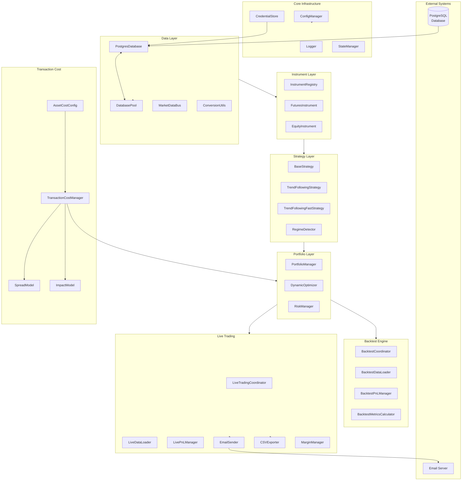
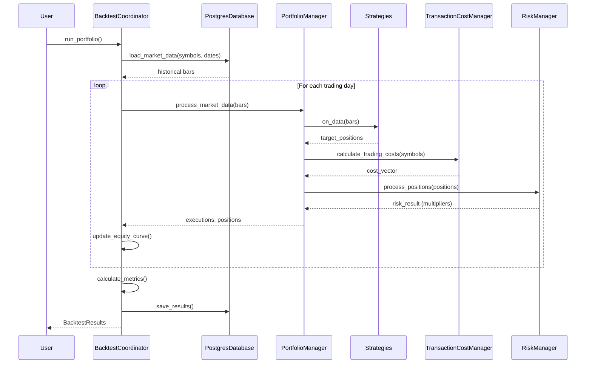
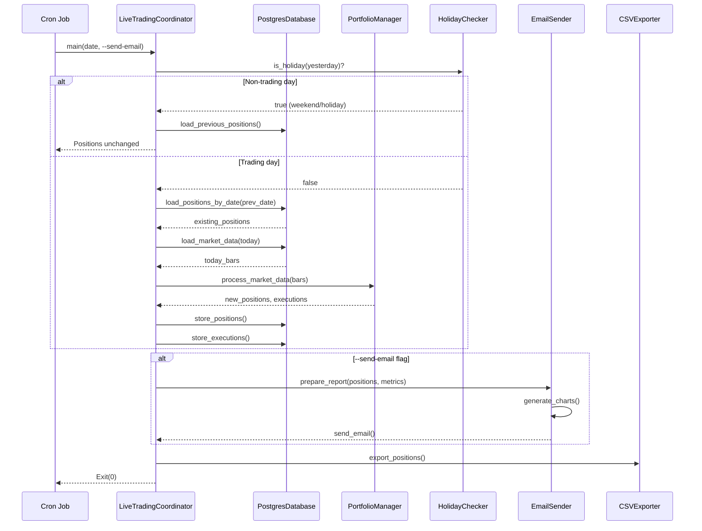

# trade-ngin
[]()
[]()
[](https://www.gnu.org/licenses/gpl-3.0)
[]()

## 📖 Project Overview

trade-ngin is a high-performance, modular quantitative trading system built in C++20 designed for professional algorithmic traders and financial institutions. The system supports systematic trading strategies with a focus on futures trading, featuring comprehensive risk management, portfolio optimization, and realistic backtesting capabilities.

### Core Capabilities

| Capability | Description |
|------------|-------------|
| **Multi-Strategy Portfolio Management** | Dynamic capital allocation across multiple strategies (e.g., TREND_FOLLOWING, TREND_FOLLOWING_FAST) |
| **Comprehensive Risk Management** | VaR constraints, position limits, leverage controls, correlation monitoring |
| **High-Performance Backtesting** | Realistic execution simulation with tick-based spread and square-root market impact models |
| **Live Trading Support** | Full production live trading with position persistence, email reports, and CSV exports |
| **Fixed-Point Arithmetic** | Custom Decimal class for financial precision (no floating-point errors) |
| **PostgreSQL Integration** | Apache Arrow for efficient data processing with connection pooling |
| **Transaction Cost Modeling** | Explicit (commissions) + Implicit (spread, market impact) cost decomposition |
| **Statistical Analysis** | PCA, stationarity tests (ADF, KPSS), cointegration, GARCH, Kalman Filter, HMM |

---

## 🚀 Quick Start (First Clone)

This section provides step-by-step instructions to get trade-ngin running from a fresh clone.

### Step 1: Clone the Repository

```bash
git clone https://github.com/AlgoGators/trade-ngin.git
cd trade-ngin
```

### Step 2: Install System Dependencies

**Option A: Use the automated setup script (Recommended)**

```bash
# Make script executable
chmod +x scripts/setup-dev-environment.sh

# Run setup (detects OS automatically)
./scripts/setup-dev-environment.sh
```

**Option B: Manual installation**

<details>
<summary><strong>Ubuntu/Debian</strong></summary>

```bash
sudo bash requirements/install_ubuntu.sh

# Or manually:
sudo apt-get update
sudo apt-get install -y \
    build-essential \
    cmake \
    clang-format \
    cpplint \
    libgtest-dev \
    nlohmann-json3-dev \
    libarrow-dev \
    libpqxx-dev \
    lcov \
    gcovr
```
</details>

<details>
<summary><strong>macOS (Homebrew)</strong></summary>

```bash
bash requirements/install_macos.sh

# Or manually:
brew install \
    cmake \
    clang-format \
    nlohmann-json \
    apache-arrow \
    libpqxx \
    lcov \
    googletest

pip3 install cpplint
```
</details>

### Step 3: Configure Database Connection

Configuration now lives in modular JSON files under `config/`:

- `config/defaults.json` (shared defaults)
- `config/portfolios/base/*.json`
- `config/portfolios/conservative/*.json`

Edit the `database` section in `config/defaults.json` (or override it in a portfolio file). For a full walkthrough, see `docs/CONFIG_GUIDE.md`.

### Step 4: Build the Project

```bash
# Create build directory
mkdir -p build && cd build

# Configure CMake
cmake ..

# Build (Release mode)
cmake --build . --config Release

# Return to project root
cd ..
```

### Step 5: Verify Installation

```bash
# Check executables exist
ls -la build/bin/Release/

# Expected outputs:
# bt_portfolio           - Main portfolio backtest
# bt_portfolio_conservative - Conservative portfolio backtest
# live_portfolio         - Main live trading application
# live_portfolio_conservative - Conservative live trading
```

### Step 6: Run Your First Backtest

```bash
./build/bin/Release/bt_portfolio
```

---

## 🚦 Quick Reference

| Document | Purpose | Location |
|----------|---------|----------|
| [Performance & Upkeep](docs/performance_upkeep.md) | CI/CD, testing, cron jobs | `docs/` |
| [Live Pipeline Spec](docs/live_pipeline_spec.md) | Live trading pipeline details | `docs/` |
| [Strategy Creation Tutorial](docs/strategy_creation_tutorial.md) | How to build your own strategy | `docs/` |
| [Transaction Cost Model](docs/transaction_cost_refactor.md) | Comprehensive cost model documentation | `docs/` |
| [Statistics Module](docs/statistics_module_deliverable.md) | Statistical analysis capabilities | `docs/` |
| [CI/CD Pipeline](docs/CI_CD_README.md) | GitHub Actions workflows, linting, coverage | `docs/` |
| [Docker Guide](docs/README.Docker.md) | Container deployment | `docs/` |

### Module-Specific Documentation

Each source module has its own detailed README:

| Module | README | Purpose |
|--------|--------|---------|
| Data | [src/data/README.md](src/data/README.md) | PostgreSQL, Arrow, connection pooling |
| Transaction Cost | [src/transaction_cost/README.md](src/transaction_cost/README.md) | Spread/impact models with worked examples |
| Statistics | [src/statistics/README.md](src/statistics/README.md) | All 9 statistical models |
| Optimization | [src/optimization/README.md](src/optimization/README.md) | Dynamic optimizer + RiskManager |
| Live Trading | [src/live/README.md](src/live/README.md) | Live coordinator, email, CSV export |
| Backtest | [src/backtest/README.md](src/backtest/README.md) | BacktestCoordinator, metrics |
| Strategy | [src/strategy/README.md](src/strategy/README.md) | Complete strategy development guide |
| Portfolio | [src/portfolio/README.md](src/portfolio/README.md) | Multi-strategy coordination |

---

## 🎯 Current System State

### Implemented Features

- ✅ **Multi-timeframe trend following strategy** with EMA crossovers across 6 timeframes
- ✅ **Multi-strategy portfolio support** (TREND_FOLLOWING + TREND_FOLLOWING_FAST)
- ✅ **28 futures contracts** support (ES, NQ, GC, CL, ZN, etc.)
- ✅ **Fixed-point arithmetic** with custom Decimal class for financial precision
- ✅ **PostgreSQL integration** with Apache Arrow and connection pooling
- ✅ **Comprehensive risk management** with VaR constraints and leverage limits
- ✅ **Dynamic portfolio optimization** with transaction cost consideration
- ✅ **Realistic transaction cost modeling** (tick-based spread + square-root impact)
- ✅ **Live trading coordinator** with position loading and persistence
- ✅ **Email reporting system** with embedded charts
- ✅ **CSV export functionality** for positions and trades
- ✅ **Non-trading day detection** (weekends + holidays)
- ✅ **Margin validation** for futures instruments
- ✅ **Extensive logging and debugging** capabilities

### Example Configuration

Configuration is modular and lives under `config/`. Shared defaults go in `config/defaults.json` and portfolio-specific overrides live in `config/portfolios/<name>/`.

Example `config/defaults.json` (shared):

```json
{
  "database": {
    "host": "your-database-host",
    "port": "5432",
    "username": "your-username",
    "password": "your-password",
    "name": "your-database-name",
    "num_connections": 5
  },
  "strategy_defaults": {
    "max_strategy_allocation": 1.0,
    "min_strategy_allocation": 0.1
  }
}
```

Example `config/portfolios/base/portfolio.json` (strategies):

```json
{
  "portfolio_id": "MY_PORTFOLIO",
  "initial_capital": 500000.0,
  "reserve_capital_pct": 0.10,
  "strategies": {
    "TREND_FOLLOWING": {
      "enabled_backtest": true,
      "enabled_live": true,
      "default_allocation": 0.6,
      "type": "TrendFollowingStrategy",
      "config": {
        "weight": 0.03,
        "risk_target": 0.2,
        "idm": 2.5,
        "ema_windows": [[2,8], [4,16], [8,32], [16,64], [32,128], [64,256]]
      }
    }
  }
}
```

> **Note**: The system fully supports multiple strategies and portfolios. Each strategy can have different allocations (must sum to 1.0), parameters, and can be independently enabled/disabled for backtest vs. live trading.

### Running Multiple Portfolios

The trade-ngin system supports running **multiple independent portfolios** simultaneously. Each portfolio:
- Has its own unique `portfolio_id`
- Can contain different strategies with different allocations
- Stores positions and results separately in the database
- Generates separate CSV exports and email reports

**Example: Portfolio A (Aggressive)**
```json
{
  "portfolio_id": "PORTFOLIO_A",
  "portfolio": {
    "strategies": {
      "TREND_FOLLOWING": { "default_allocation": 0.7 },
      "MEAN_REVERSION": { "default_allocation": 0.3 }
    }
  }
}
```

**Example: Portfolio B (Conservative)**
```json
{
  "portfolio_id": "PORTFOLIO_B",
  "portfolio": {
    "strategies": {
      "TREND_FOLLOWING": { "default_allocation": 1.0 }
    }
  }
}
```

To run different portfolios, create separate config files (e.g., `config_portfolio_a.json`, `config_portfolio_b.json`) and build separate executables or pass the config path at runtime. All portfolio data is isolated by `portfolio_id` in the database.

### Key Parameters Explained

| Parameter | Value | Description |
|-----------|-------|-------------|
| **Initial Capital** | $500,000 | Starting portfolio capital |
| **IDM** | 2.5 | Instrument Diversification Multiplier |
| **Weight per Symbol** | 0.03 (3%) | Maximum allocation per instrument |
| **Risk Target** | 0.20-0.25 | Annualized volatility target |
| **Max Gross Leverage** | 4.0x | Maximum total exposure |
| **Max Net Leverage** | 2.0x | Maximum directional exposure |
| **VaR Limit** | 0.15 (15%) | Maximum 99% daily VaR |
| **Reserve Capital** | 10% | Capital held in reserve |

---

## 📂 Repository Structure

```
trade-ngin/
├── apps/                           # Application executables
│   ├── backtest/                   # Backtesting applications
│   │   ├── bt_portfolio.cpp        # Main portfolio backtest runner
│   │   ├── bt_portfolio_conservative.cpp  # Conservative variant
│   │   └── CMakeLists.txt
│   ├── strategies/                 # Live trading applications
│   │   ├── live_portfolio.cpp      # Main live trading application
│   │   ├── live_portfolio_conservative.cpp
│   │   └── results/                # Live trading CSV outputs
│   │       └── PORTFOLIO_A/        # Portfolio-specific results
│   └── CMakeLists.txt
│
├── include/trade_ngin/             # Public header files (65 total)
│   ├── backtest/                   # Backtest components (10 headers)
│   │   ├── backtest_coordinator.hpp
│   │   ├── backtest_data_loader.hpp
│   │   ├── backtest_execution_manager.hpp
│   │   ├── backtest_metrics_calculator.hpp
│   │   ├── backtest_pnl_manager.hpp
│   │   ├── backtest_portfolio_constraints.hpp
│   │   ├── backtest_price_manager.hpp
│   │   ├── backtest_types.hpp
│   │   ├── slippage_models.hpp
│   │   └── transaction_cost_analysis.hpp
│   ├── core/                       # Core system components (14 headers)
│   │   ├── chart_generator.hpp     # Chart generation for emails
│   │   ├── config_base.hpp
│   │   ├── config_manager.hpp
│   │   ├── email_sender.hpp        # Email report system
│   │   ├── error.hpp               # Error types and Result<T>
│   │   ├── holiday_checker.hpp     # Holiday detection
│   │   ├── holidays.json           # CME holiday calendar
│   │   ├── logger.hpp              # Logging framework
│   │   ├── run_id_generator.hpp
│   │   ├── state_manager.hpp
│   │   ├── time_utils.hpp
│   │   └── types.hpp               # Core types (Decimal, Bar, Position, etc.)
│   ├── data/                       # Data management (6 headers)
│   │   ├── conversion_utils.hpp    # Arrow ↔ domain conversion
│   │   ├── credential_store.hpp    # Secure credential access
│   │   ├── database_interface.hpp  # Abstract database interface
│   │   ├── database_pooling.hpp    # Connection pool
│   │   ├── market_data_bus.hpp     # Pub-sub for market data
│   │   └── postgres_database.hpp   # PostgreSQL implementation
│   ├── execution/                  # Order execution
│   │   └── execution_engine.hpp
│   ├── instruments/                # Financial instruments (5 headers)
│   │   ├── equity.hpp
│   │   ├── futures.hpp             # Futures with margin requirements
│   │   ├── instrument.hpp          # Base instrument interface
│   │   ├── instrument_registry.hpp # Singleton registry
│   │   └── option.hpp
│   ├── live/                       # Live trading components (10 headers)
│   │   ├── csv_exporter.hpp        # CSV output generation
│   │   ├── execution_manager.hpp
│   │   ├── live_data_loader.hpp
│   │   ├── live_metrics_calculator.hpp
│   │   ├── live_pnl_manager.hpp
│   │   ├── live_price_manager.hpp  # T-1/T-2 price tracking
│   │   ├── live_trading_coordinator.hpp  # Main orchestrator
│   │   ├── margin_manager.hpp      # Margin requirement validation
│   │   ├── pnl_manager_base.hpp
│   │   └── price_manager_base.hpp
│   ├── optimization/               # Portfolio optimization
│   │   └── dynamic_optimizer.hpp   # Cost-aware optimization
│   ├── order/                      # Order management
│   │   └── order_manager.hpp
│   ├── portfolio/                  # Portfolio management
│   │   └── portfolio_manager.hpp   # Multi-strategy coordination
│   ├── risk/                       # Risk management
│   │   └── risk_manager.hpp        # VaR, leverage limits
│   ├── statistics/                 # Statistical analysis
│   │   └── statistics_tools.hpp    # PCA, GARCH, Kalman, HMM
│   ├── storage/                    # Results persistence (3 headers)
│   │   ├── backtest_results_manager.hpp
│   │   ├── live_results_manager.hpp
│   │   └── results_manager_base.hpp
│   ├── strategy/                   # Strategy components (7 headers)
│   │   ├── base_strategy.hpp       # Common strategy functionality
│   │   ├── regime_detector.hpp     # Market regime classification
│   │   ├── strategy_interface.hpp  # Abstract interface
│   │   ├── trend_following.hpp     # Main trend strategy
│   │   ├── trend_following_fast.hpp
│   │   ├── trend_following_slow.hpp
│   │   └── types.hpp               # Strategy-specific types
│   └── transaction_cost/           # Transaction cost modeling (4 headers)
│       ├── asset_cost_config.hpp   # Per-symbol configurations
│       ├── impact_model.hpp        # Square-root market impact
│       ├── spread_model.hpp        # Tick-based spread with vol widening
│       └── transaction_cost_manager.hpp  # Main orchestrator
│
├── src/                            # Implementation files (61 files)
│   ├── backtest/                   # Backtest implementations (9 files)
│   │   ├── backtest_coordinator.cpp      # Main orchestrator
│   │   ├── backtest_data_loader.cpp
│   │   ├── backtest_execution_manager.cpp
│   │   ├── backtest_metrics_calculator.cpp
│   │   ├── backtest_pnl_manager.cpp
│   │   ├── backtest_portfolio_constraints.cpp
│   │   ├── backtest_price_manager.cpp
│   │   ├── slippage_model.cpp
│   │   └── transaction_cost_analysis.cpp
│   ├── core/                       # Core implementations (8 files)
│   │   ├── chart_generator.cpp           # Gnuplot chart generation
│   │   ├── config_base.cpp
│   │   ├── config_manager.cpp
│   │   ├── config_version.cpp
│   │   ├── email_sender.cpp              # SMTP with HTML/charts
│   │   ├── logger.cpp                    # File rotation, log levels
│   │   ├── run_id_generator.cpp
│   │   └── state_manager.cpp
│   ├── data/                       # Data implementations (6 files)
│   │   ├── conversion_utils.cpp
│   │   ├── credential_store.cpp
│   │   ├── database_pooling.cpp         # Connection pool with retry
│   │   ├── market_data_bus.cpp
│   │   ├── postgres_database.cpp        # All data operations
│   │   └── postgres_database_extensions.cpp
│   ├── execution/
│   │   └── execution_engine.cpp
│   ├── instruments/                # Instrument implementations (4 files)
│   │   ├── equity.cpp
│   │   ├── futures.cpp                  # Margin, multiplier, expiry
│   │   ├── instrument_registry.cpp
│   │   └── option.cpp
│   ├── live/                       # Live trading implementations (8 files)
│   │   ├── csv_exporter.cpp
│   │   ├── execution_manager.cpp
│   │   ├── live_data_loader.cpp
│   │   ├── live_metrics_calculator.cpp
│   │   ├── live_pnl_manager.cpp
│   │   ├── live_price_manager.cpp
│   │   ├── live_trading_coordinator.cpp
│   │   └── margin_manager.cpp
│   ├── optimization/
│   │   └── dynamic_optimizer.cpp        # Cost-aware optimization
│   ├── order/
│   │   └── order_manager.cpp
│   ├── portfolio/
│   │   └── portfolio_manager.cpp
│   ├── risk/
│   │   └── risk_manager.cpp             # VaR, leverage, correlation
│   ├── statistics/
│   │   └── statistics_tools.cpp         # All statistical models
│   ├── storage/                    # Results persistence (3 files)
│   │   ├── backtest_results_manager.cpp
│   │   ├── live_results_manager.cpp
│   │   └── results_manager_base.cpp
│   ├── strategy/                   # Strategy implementations (5 files)
│   │   ├── base_strategy.cpp
│   │   ├── regime_detector.cpp
│   │   ├── trend_following.cpp          # Main trend strategy
│   │   ├── trend_following_fast.cpp
│   │   └── trend_following_slow.cpp
│   └── transaction_cost/           # Transaction cost implementations (4 files)
│       ├── asset_cost_config.cpp
│       ├── impact_model.cpp
│       ├── spread_model.cpp
│       └── transaction_cost_manager.cpp
│
├── tests/                          # Unit and integration tests (27 test files)
│   ├── backtesting/                # Backtest engine tests
│   ├── core/                       # Logger, config tests
│   ├── data/                       # Database, conversion tests
│   ├── execution/                  # Execution engine tests
│   ├── optimization/               # Optimizer tests
│   ├── order/                      # Order manager tests
│   ├── portfolio/                  # Portfolio manager tests
│   ├── risk/                       # Risk manager tests
│   ├── statistics/                 # Statistics tools tests
│   └── strategy/                   # Strategy tests
│
├── docs/                           # Documentation (27 files)
│   ├── CI_CD_README.md             # CI/CD pipeline documentation
│   ├── CI_CD_IMPLEMENTATION_SUMMARY.md
│   ├── LIBRARY_API_ARCHITECTURE.md # API design guide
│   ├── README.Docker.md            # Docker deployment
│   ├── TYPE_CONVERSION_GUIDE.md    # Type system guide
│   ├── commission_CHANGES.md       # Commission model changes
│   ├── commission_MIGRATION.md     # Migration guide
│   ├── config_deliverable.md       # Configuration specification
│   ├── futures_enhancements_transaction_costs.md
│   ├── live_pipeline_spec.md       # Live trading specification
│   ├── live_portfolio_multi_strategy_migration.md
│   ├── live_portfolio_refactoring_analysis.md
│   ├── multi_portfolio_email_csv_analysis.md
│   ├── non_trading_day_fix.md      # Holiday handling
│   ├── performance_upkeep.md       # Cron jobs, monitoring
│   ├── statistics.md               # Statistics overview
│   ├── statistics_model_improvement.md
│   ├── statistics_module_deliverable.md
│   ├── strategy_creation_tutorial.md
│   ├── strategy_level_metrics.md
│   ├── transaction_cost_config_fixes.md
│   ├── transaction_cost_migration_guide.md
│   └── transaction_cost_refactor.md
│
├── scripts/                        # Development scripts
│   ├── dev_build_run.sh            # Quick build and run
│   ├── pre-commit-hook.sh          # Pre-commit checks
│   ├── run_live_trend.sh           # Live trading launcher
│   └── setup-dev-environment.sh    # Environment setup
│
├── linting/                        # Code quality tools
│   ├── lint_runner.sh              # Linting runner
│   └── auto_fix_lint.sh            # Auto-fix formatting
│
├── requirements/                   # Dependency installation
│   ├── README.md                   # Installation guide
│   ├── install_ubuntu.sh           # Ubuntu dependencies
│   └── install_macos.sh            # macOS dependencies
│
├── config/                         # Modular configuration
│   ├── defaults.json               # Shared defaults
│   └── portfolios/                 # Per-portfolio overrides
│       ├── base/
│       └── conservative/
├── config.json                     # Legacy single-file config (deprecated)
├── config_template.json            # Template for new configs
├── CMakeLists.txt                  # Main build configuration
├── Dockerfile                      # Docker container definition
├── build_docker.sh                 # Docker build script
└── live_trend.cron                 # Cron job definition
```

---

## ⚙️ System Architecture

trade-ngin follows a modular, component-based architecture with well-defined interfaces between system components.

### High-Level Architecture



> **Tip**: For detailed component documentation, see the module-specific READMEs listed in [Quick Reference](#-quick-reference).

---

## 🔢 Core Type System

trade-ngin uses a custom type system for financial precision:

### Decimal Class

The `Decimal` class (`include/trade_ngin/core/types.hpp`) provides fixed-point arithmetic with 8 decimal places:

```cpp
// 8 decimal places for financial precision
class Decimal {
    static constexpr int64_t SCALE = 100000000LL;  // 10^8
    int64_t value_;
    
public:
    Decimal(double d);  // Converts with rounding
    explicit operator double() const;
    
    // Arithmetic with overflow checking
    Decimal operator+(const Decimal& other) const;
    Decimal operator*(const Decimal& other) const;
    // ... etc
    
    // Utilities
    Decimal abs() const;
    bool is_zero() const;
    std::string to_string() const;
};
```

### Type Aliases

```cpp
using Timestamp = std::chrono::system_clock::time_point;
using Price = Decimal;
using Quantity = Decimal;
```

### Core Structures

```cpp
// Market data bar
struct Bar {
    Timestamp timestamp;
    Price open, high, low, close;
    double volume;
    std::string symbol;
};

// Position tracking
struct Position {
    std::string symbol;
    Quantity quantity;
    Price average_price;
    Decimal unrealized_pnl;
    Decimal realized_pnl;
    Timestamp last_update;
};

// Execution report with cost breakdown
struct ExecutionReport {
    std::string order_id;
    std::string symbol;
    Side side;
    Quantity filled_quantity;
    Price fill_price;
    Decimal commissions_fees;          // Explicit costs
    Decimal implicit_price_impact;     // Spread + impact
    Decimal slippage_market_impact;    // Implicit costs in $
    Decimal total_transaction_costs;   // Total
};
```

---

## � Logging System

trade-ngin includes a comprehensive, thread-safe logging system for debugging, monitoring, and auditing.

### Log Levels

| Level | Macro | Usage |
|-------|-------|-------|
| `TRACE` | `TRACE(msg)` | Detailed debug information (very verbose) |
| `DEBUG` | `DEBUG(msg)` | General debug information |
| `INFO` | `INFO(msg)` | General operational information |
| `WARNING` | `WARN(msg)` | Warnings that don't affect operation |
| `ERROR` | `ERROR(msg)` | Errors that affect operation but don't stop system |
| `FATAL` | `FATAL(msg)` | Critical errors requiring system shutdown |

### Using the Logger

```cpp
#include "trade_ngin/core/logger.hpp"

// Initialize once at startup
LoggerConfig config;
config.min_level = LogLevel::INFO;
config.destination = LogDestination::BOTH;  // Console + file
config.log_directory = "logs";
config.filename_prefix = "live_trend";
config.max_file_size = 50 * 1024 * 1024;  // 50MB
config.max_files = 10;

Logger::instance().initialize(config);

// Log messages
INFO("Portfolio initialized with capital: $" << initial_capital);
DEBUG("Loading positions for date: " << date_str);
WARN("No market data available for: " << symbol);
ERROR("Database connection failed: " << error_msg);
```

### Log Output Format

```
[2025-01-15 09:30:45.123] [INFO] Portfolio initialized with capital: $500000
[2025-01-15 09:30:45.456] [DEBUG] Loading 28 instruments from registry
[2025-01-15 09:30:46.789] [INFO] Strategy TREND_FOLLOWING generating signals
```

### Database Logging

Both backtest and live trading log key operations to the database for auditing:

#### Backtest Logging

During backtests, the following is recorded:
- **Daily equity snapshots** stored in `trading.backtest_equity_curve`
- **Trade executions** with full cost breakdown
- **Metrics calculated** at backtest completion

```cpp
// Logged during backtest
INFO("Processing date: " << date << " | Equity: $" << equity);
DEBUG("Symbol: " << symbol << " | Signal: " << signal << " | Position: " << position);
```

#### Live Trading Logging

During live runs, extensive logging captures:

```cpp
// Position loading
INFO("Loading positions for date: " << date << " | Portfolio: " << portfolio_id);

// Strategy signals
INFO("Strategy " << strategy_id << " signal for " << symbol << ": " << signal);

// Position changes
INFO("Position change: " << symbol << " | Old: " << old_qty << " | New: " << new_qty);

// Database operations
DEBUG("Storing position: " << symbol << " | Qty: " << qty << " | Price: " << price);

// Risk validation
INFO("Risk check: Gross=" << gross_lev << " | Net=" << net_lev << " | VaR=" << var);
```

### Log File Location

| Mode | Log Location | Filename Pattern |
|------|--------------|------------------|
| Backtest | `logs/` | `bt_portfolio_YYYYMMDD_HHMMSS.log` |
| Live | `logs/` | `live_trend_YYYYMMDD.log` |

### Changing Log Level at Runtime

```cpp
// Change minimum log level
Logger::instance().set_level(LogLevel::DEBUG);

// Get current level
LogLevel current = Logger::instance().get_min_level();
```

---

## �💰 Transaction Cost Model

trade-ngin implements a comprehensive transaction cost model based on Robert Carver's methodology. See [transaction_cost_refactor.md](docs/transaction_cost_refactor.md) for full specification or [src/transaction_cost/README.md](src/transaction_cost/README.md) for implementation details.

### Cost Components

```
total_transaction_costs = explicit_costs + implicit_costs

explicit_costs = |quantity| × $1.75 per contract
implicit_costs = (spread_cost + market_impact) × |quantity| × point_value
```

### Spread Model (Tick-Based)

```cpp
spread_price_impact = 0.5 × spread_ticks × tick_size × volatility_multiplier
```

Where:
- `spread_ticks` = baseline spread in ticks (per instrument)
- `tick_size` = minimum price increment (e.g., 0.25 for ES)
- `volatility_multiplier` = 1.0 ± λ × z_σ (widens in high volatility)

### Market Impact (Square-Root Law)

```cpp
impact_bps = k_bps × √(|quantity| / ADV)
market_impact_price_impact = (impact_bps / 10000) × reference_price
```

Where `k_bps` is selected based on ADV buckets:
| ADV | k_bps | Category |
|-----|-------|----------|
| > 1,000,000 | 10 | Ultra liquid |
| > 200,000 | 20 | Liquid |
| > 50,000 | 40 | Medium |
| > 20,000 | 60 | Thin |
| ≤ 20,000 | 80 | Very thin |

### Worked Example (ES Futures)

```
Given:
  - Reference Price: $5,000
  - Quantity: 10 contracts
  - Tick Size: 0.25 points
  - Point Value: $50
  - ADV: 500,000 contracts

Calculations:
  Explicit:     10 × $1.75 = $17.50
  Spread:       0.5 × 1 × 0.25 = 0.125 points
  Impact:       10 × √(10/500000) × 5000/10000 = 0.02235 points
  Implicit:     (0.125 + 0.02235) × 10 × 50 = $73.68
  
  Total:        $17.50 + $73.68 = $91.18
```

---

## 📊 Statistics Module

The statistics module provides quantitative analysis capabilities. See [src/statistics/README.md](src/statistics/README.md) for detailed usage.

### Available Models

| Category | Model | Status | Usage |
|----------|-------|--------|-------|
| **Transformers** | Normalizer (Z-Score, Min-Max, Robust) | ✅ Complete | Data preprocessing |
| **Transformers** | PCA (variance threshold, whitening) | ✅ Complete | Dimensionality reduction |
| **Stationarity** | ADF Test | ✅ Complete | Unit root testing |
| **Stationarity** | KPSS Test | ✅ Complete | Stationarity confirmation |
| **Cointegration** | Johansen Test | ✅ Complete | Multi-series cointegration |
| **Cointegration** | Engle-Granger Test | ✅ Complete | Pairwise cointegration |
| **Volatility** | GARCH(1,1) | ✅ Complete | Volatility forecasting |
| **State Estimation** | Kalman Filter | ✅ Complete | Signal extraction |
| **State Estimation** | Hidden Markov Model | ✅ Complete | Regime detection |

### Example: Running ADF Test

```cpp
#include "trade_ngin/statistics/statistics_tools.hpp"

// Test for stationarity
auto result = statistics::adf_test(price_series, 5);  // 5 lags
if (result.p_value < 0.05) {
    // Series is stationary
}
```

---

## 🔄 Workflows

### Backtesting Workflow



### Live Trading Workflow



---

## 🛠️ Setup & Installation

> **Quick Start**: For the fastest setup, follow the [Quick Start](#-quick-start-first-clone) section.

### Prerequisites

| Requirement | Version | Purpose |
|-------------|---------|---------|
| C++ Compiler | GCC 10+ / Clang 10+ / MSVC 2019+ | C++20 support |
| CMake | 3.17+ | Build configuration |
| PostgreSQL | 12+ | Market data storage |
| nlohmann_json | Latest | JSON configuration |
| Apache Arrow C++ | Latest | Efficient data processing |
| libpqxx | Latest | PostgreSQL C++ client |
| Eigen3 | Latest | Linear algebra for optimization |
| libcurl | Latest | Email functionality |
| GoogleTest | Bundled | Unit testing |

### System Requirements

- **Memory**: 8GB+ RAM for typical backtests
- **Storage**: SSD recommended for database
- **OS**: Linux (preferred), macOS, Windows (WSL2)

### Debug Build (with coverage)

```bash
mkdir -p build && cd build

cmake .. \
    -DCMAKE_BUILD_TYPE=Debug \
    -DCMAKE_CXX_FLAGS="-g -O0 -fprofile-arcs -ftest-coverage"

cmake --build . -j$(nproc)
cd ..
```

### Running Unit Tests

```bash
cd build
ctest --output-on-failure --verbose
```

---

## 🚀 Running the System

### Running Backtests

```bash
# Run main backtest
./build/bin/Release/bt_portfolio

# Run conservative portfolio backtest
./build/bin/Release/bt_portfolio_conservative
```

### Running Live Trading

Live trading requires a date argument in `YYYY-MM-DD` format:

```bash
# Run for a specific date (no email)
./build/bin/Release/live_portfolio 2025-01-15

# Run for a specific date WITH email report
./build/bin/Release/live_portfolio 2025-01-15 --send-email

# Conservative portfolio variant
./build/bin/Release/live_portfolio_conservative 2025-01-15 --send-email
```

> **Note**: The date-less execution mode is deprecated. Always specify the date.

### Output Locations

| Output Type | Location | Description |
|-------------|----------|-------------|
| Logs | `logs/live_trend_YYYYMMDD.log` | Daily log files |
| CSV Exports | `apps/strategies/results/<portfolio_id>/` | Position files |
| Database | `trading.positions` | Persisted positions |

---

## 📝 Additional Configuration

### Strategy Types

| Type | Class | Description |
|------|-------|-------------|
| `TrendFollowingStrategy` | `TrendFollowingStrategy` | Standard 6-window trend following |
| `TrendFollowingFastStrategy` | `TrendFollowingFastStrategy` | Faster-reacting (shorter windows) |
| `TrendFollowingSlowStrategy` | `TrendFollowingSlowStrategy` | Slower-reacting (longer windows) |

### Email Configuration

```json
{
  "email": {
    "smtp_host": "smtp.gmail.com",
    "smtp_port": 587,
    "username": "your-email@gmail.com",
    "password": "your-app-password",
    "from_email": "your-email@gmail.com",
    "to_emails": ["recipient1@example.com", "recipient2@example.com"],
    "use_tls": true
  }
}
```

> **Gmail Setup**: Use an [App Password](https://support.google.com/accounts/answer/185833) rather than your account password.

---

## 🗄️ Database Schema

### Core Tables

| Schema | Table | Purpose |
|--------|-------|---------|
| `trading` | `positions` | Current and historical positions |
| `trading` | `executions` | Trade execution records |
| `trading` | `live_run_metadata` | Daily run configuration |
| `trading` | `strategy_trading_days_metadata` | Strategy configuration history |
| `futures_data` | `ohlcv_1d` | Daily OHLCV data |
| `futures_data` | `instruments` | Contract specifications |

### Position Table Structure

```sql
CREATE TABLE trading.positions (
    id SERIAL PRIMARY KEY,
    date DATE NOT NULL,
    portfolio_id VARCHAR(255) NOT NULL,
    strategy_id VARCHAR(255) NOT NULL,
    symbol VARCHAR(50) NOT NULL,
    quantity DECIMAL(18,8),
    average_price DECIMAL(18,8),
    unrealized_pnl DECIMAL(18,8),
    realized_pnl DECIMAL(18,8),
    created_at TIMESTAMP DEFAULT CURRENT_TIMESTAMP
);
```

### Execution Table Structure

```sql
CREATE TABLE trading.executions (
    id SERIAL PRIMARY KEY,
    date DATE NOT NULL,
    portfolio_id VARCHAR(255) NOT NULL,
    strategy_id VARCHAR(255) NOT NULL,
    symbol VARCHAR(50) NOT NULL,
    side VARCHAR(10),
    quantity DECIMAL(18,8),
    price DECIMAL(18,8),
    commission DECIMAL(18,8),
    slippage DECIMAL(18,8),
    total_cost DECIMAL(18,8),
    created_at TIMESTAMP DEFAULT CURRENT_TIMESTAMP
);
```

---

## 🏗️ Creating a New Strategy

For comprehensive strategy development instructions, see [src/strategy/README.md](src/strategy/README.md).

### Quick Start

1. **Create header** in `include/trade_ngin/strategy/your_strategy.hpp`
2. **Implement** in `src/strategy/your_strategy.cpp`
3. **Inherit from** `BaseStrategy`
4. **Override required methods**: `initialize()`, `on_data()`, `validate_config()`
5. **Register** in `CMakeLists.txt` (add to `TRADE_NGIN_SOURCES`)
6. **Add to factory** in `live_portfolio.cpp` and `bt_portfolio.cpp`
7. **Configure** in `config/portfolios/<name>/portfolio.json` under `strategies`

### Minimal Example

```cpp
// include/trade_ngin/strategy/my_strategy.hpp
#pragma once

#include "trade_ngin/strategy/base_strategy.hpp"

namespace trade_ngin {

struct MyStrategyConfig {
    double parameter1 = 0.5;
    int lookback_window = 20;
};

class MyStrategy : public BaseStrategy {
public:
    MyStrategy(std::string id, 
               StrategyConfig config,
               MyStrategyConfig my_config,
               std::shared_ptr<PostgresDatabase> db,
               std::shared_ptr<InstrumentRegistry> registry);

    Result<void> initialize() override;
    Result<void> on_data(const std::vector<Bar>& data) override;

protected:
    Result<void> validate_config() const override;

private:
    MyStrategyConfig my_config_;
};

}  // namespace trade_ngin
```

```cpp
// src/strategy/my_strategy.cpp
#include "trade_ngin/strategy/my_strategy.hpp"

namespace trade_ngin {

MyStrategy::MyStrategy(std::string id,
                       StrategyConfig config,
                       MyStrategyConfig my_config,
                       std::shared_ptr<PostgresDatabase> db,
                       std::shared_ptr<InstrumentRegistry> registry)
    : BaseStrategy(std::move(id), std::move(config), db, registry),
      my_config_(my_config) {}

Result<void> MyStrategy::initialize() {
    auto validate_result = validate_config();
    if (validate_result.is_error()) {
        return validate_result;
    }
    
    INFO("MyStrategy initialized with parameter1=" + 
         std::to_string(my_config_.parameter1));
    return Result<void>();
}

Result<void> MyStrategy::on_data(const std::vector<Bar>& data) {
    // Your trading logic here
    for (const auto& bar : data) {
        // Calculate signal
        double signal = calculate_signal(bar);
        
        // Size position
        double position = signal * get_position_size(bar.symbol);
        
        // Update target
        update_target_position(bar.symbol, position);
    }
    return Result<void>();
}

Result<void> MyStrategy::validate_config() const {
    if (my_config_.parameter1 <= 0 || my_config_.parameter1 > 1.0) {
        return make_error<void>(ErrorCode::INVALID_ARGUMENT,
                                "parameter1 must be in (0, 1]",
                                "MyStrategy");
    }
    return Result<void>();
}

}  // namespace trade_ngin
```

---

## 🛡️ Error Handling

trade-ngin uses the `Result<T>` pattern for error propagation (see `include/trade_ngin/core/error.hpp`):

```cpp
Result<void> MyComponent::operation() {
    auto result = other_component->do_something();
    if (result.is_error()) {
        return make_error<void>(
            result.error()->code(),
            "Failed during operation: " + std::string(result.error()->what()),
            "MyComponent"
        );
    }
    return Result<void>();
}

// Usage
auto result = component.operation();
if (result.is_error()) {
    ERROR(result.error()->what());
    return 1;
}
```

### Common Error Codes

| Code | Meaning |
|------|---------|
| `INVALID_ARGUMENT` | Invalid parameter provided |
| `NOT_INITIALIZED` | Component not initialized |
| `DATABASE_ERROR` | Database operation failed |
| `DATA_NOT_FOUND` | Requested data not found |
| `STRATEGY_ERROR` | Strategy logic error |
| `RISK_LIMIT_EXCEEDED` | Risk constraint violated |
| `MARGIN_VALIDATION_FAILED` | Margin requirements not met |

---

## 📊 Performance Considerations

### Data Processing
- Apache Arrow for zero-copy data sharing
- Columnar memory layout for vectorized operations
- Connection pooling for database efficiency (5 connections by default)

### Memory Management
- RAII pattern throughout
- Smart pointers (`std::shared_ptr`, `std::unique_ptr`) for automatic resource management
- Preallocated buffers for performance-critical operations

### Concurrency
- Thread-safe component designs with mutex protection
- Pub-sub pattern for market data distribution
- Connection pool with thread-safe acquisition

### Optimization Tips
- Use `reserve()` on vectors when size is known
- Avoid unnecessary copies (use `const&` or move semantics)
- Profile with `perf` or `valgrind` for bottlenecks

---

## 🐳 Docker Deployment

The system includes Docker support for containerized deployment:

```bash
# Build Docker image
./build_docker.sh

# Or manually:
docker build -t trade-ngin -f Dockerfile .

# Run container
docker run -d \
    --name trade-ngin \
    -v $(pwd)/config:/app/config \
    -v $(pwd)/logs:/app/logs \
    trade-ngin
```

### Docker Configuration

The container includes:
- All system dependencies
- Cron job for scheduled runs (`live_trend.cron`)
- Gnuplot for chart generation
- Timezone set to America/New_York

---

## 🔧 CI/CD Pipeline

The project uses GitHub Actions for continuous integration. See [docs/CI_CD_README.md](docs/CI_CD_README.md) for details.

### Pipelines

| Workflow | Trigger | Purpose |
|----------|---------|---------|
| `ci-cd-pipeline.yml` | Push, PR | Lint, build, test |
| `code-coverage.yml` | Push, PR | Coverage reports |

### Local Pre-commit Checks

```bash
# Run before each commit
./scripts/pre-commit-hook.sh

# Run linting
./linting/lint_runner.sh

# Auto-fix formatting
./linting/auto_fix_lint.sh
```

### Coverage Requirements

- **Minimum Coverage**: 75%
- **Tools**: lcov, gcovr
- **Reports**: HTML, XML (Cobertura)

---

## 🧪 Testing

### Running Tests

```bash
cd build

# Run all tests
ctest --output-on-failure

# Run specific test
./tests/test_portfolio_manager

# Run with verbose output
ctest -V

# Run with coverage
cmake .. -DCMAKE_BUILD_TYPE=Debug \
    -DCMAKE_CXX_FLAGS="-g -O0 -fprofile-arcs -ftest-coverage"
make -j$(nproc)
ctest
lcov --capture --directory . --output-file coverage.info
genhtml coverage.info --output-directory coverage_html
```

### Test Structure

```
tests/
├── backtesting/          # BacktestCoordinator tests
├── core/                 # Logger, config tests
├── data/                 # Database tests
├── execution/            # Execution engine tests
├── optimization/         # Optimizer tests
├── order/                # Order manager tests
├── portfolio/            # Portfolio manager tests
├── risk/                 # Risk manager tests
├── statistics/           # Statistics tools tests
└── strategy/             # Strategy tests
```

---

## 📋 Troubleshooting

### Common Issues

#### Build Failures

**Missing dependencies:**
```bash
# Ubuntu
sudo apt-get install libarrow-dev nlohmann-json3-dev libpqxx-dev

# macOS
brew install apache-arrow nlohmann-json libpqxx
```

**libpqxx not found:**
```bash
# Check pkg-config
pkg-config --libs libpqxx

# If missing, add to PKG_CONFIG_PATH
export PKG_CONFIG_PATH="/opt/homebrew/lib/pkgconfig:$PKG_CONFIG_PATH"
```

#### Database Connection Errors

**Connection refused:**
- Check database host is accessible
- Verify port 5432 is open
- Confirm credentials in `config/defaults.json` (or portfolio override)

**Missing tables:**
- Ensure required schemas exist (`trading`, `futures_data`)
- Run database migrations if available

#### Live Trading Issues

**No market data:**
- Check if date is a trading day
- Verify data exists in `futures_data.ohlcv_1d`
- Ensure symbols list is correct

**Email not sending:**
- Verify SMTP credentials
- Check Gmail App Password (not account password)
- Confirm recipient email addresses

### Debug Logging

Enable verbose logging:
```cpp
// In config or at runtime
LoggerConfig config;
config.min_level = LogLevel::DEBUG;  // or TRACE for maximum detail
```

### Getting Help

1. Check the `logs/` directory for error details
2. Review relevant documentation in `docs/`
3. Create an issue with:
   - Error message
   - Steps to reproduce
   - Configuration (sanitized)
   - Log snippets

---

## 👥 Development Guidelines

### Code Style

- Follow [Google C++ Style Guide](https://google.github.io/styleguide/cppguide.html)
- Use `clang-format` with the provided `.clang-format` configuration
- Run linting before committing

### Naming Conventions

| Item | Convention | Example |
|------|------------|---------|
| Classes | PascalCase | `PortfolioManager` |
| Functions | snake_case | `calculate_position()` |
| Variables | snake_case | `target_position` |
| Constants | UPPER_SNAKE | `MAX_LEVERAGE` |
| Files | snake_case | `portfolio_manager.cpp` |
| Headers | snake_case.hpp | `portfolio_manager.hpp` |

### Git Workflow

1. Create feature branch from `develop`
2. Make changes with meaningful commits
3. Run pre-commit checks
4. Create PR to `develop`
5. Address code review feedback
6. Merge after approval


## 📄 License

This project is licensed under the GNU General Public License v3.0 - see the [LICENSE](LICENSE) file for details.

---

## Acknowledgments

- Robert Carver for systematic trading methodology
- AlgoGators team for contributions
- Open source community for tooling

---

*Last updated: January 2026*
