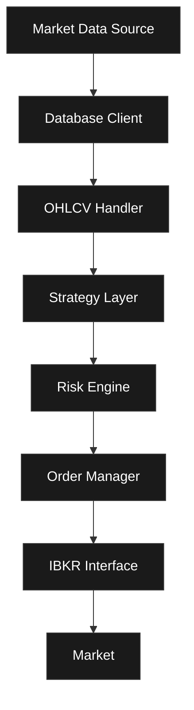
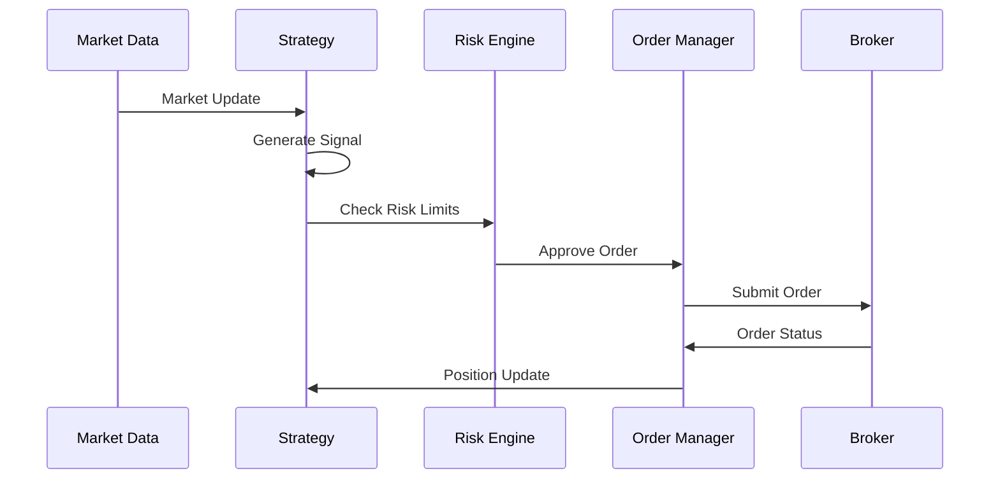
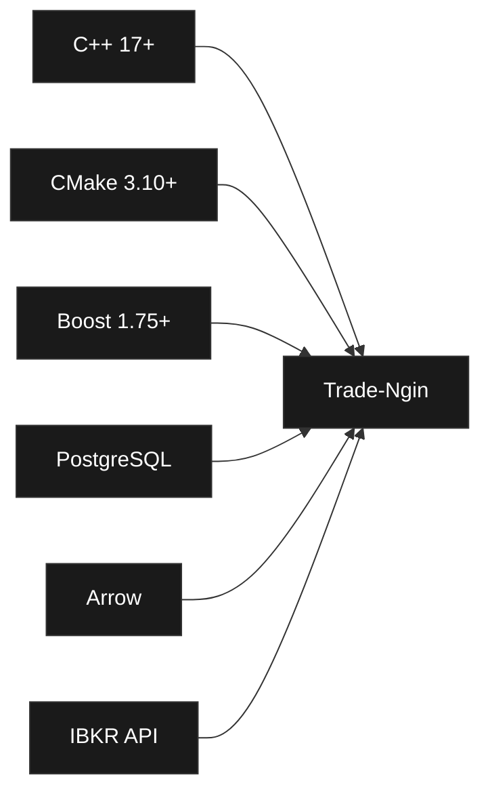
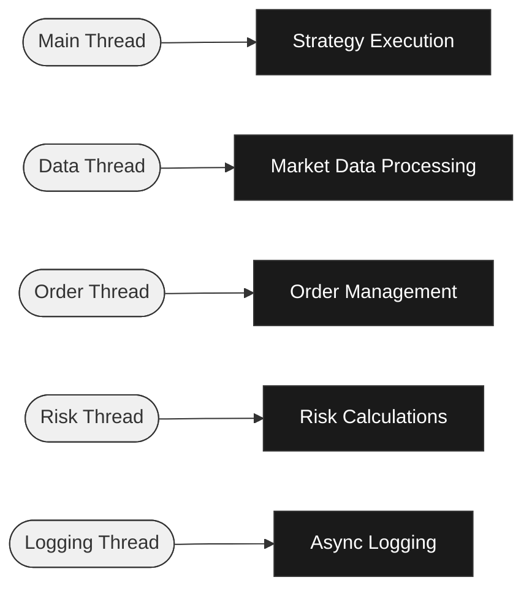
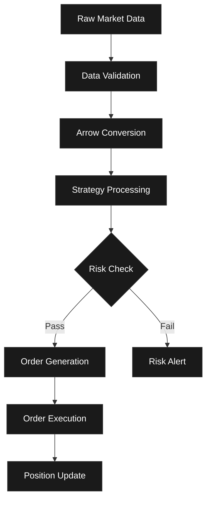
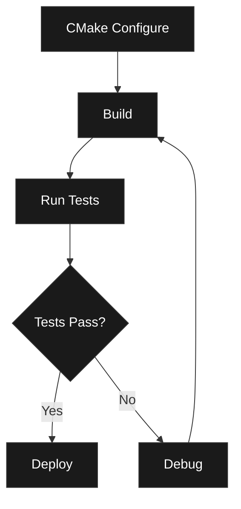
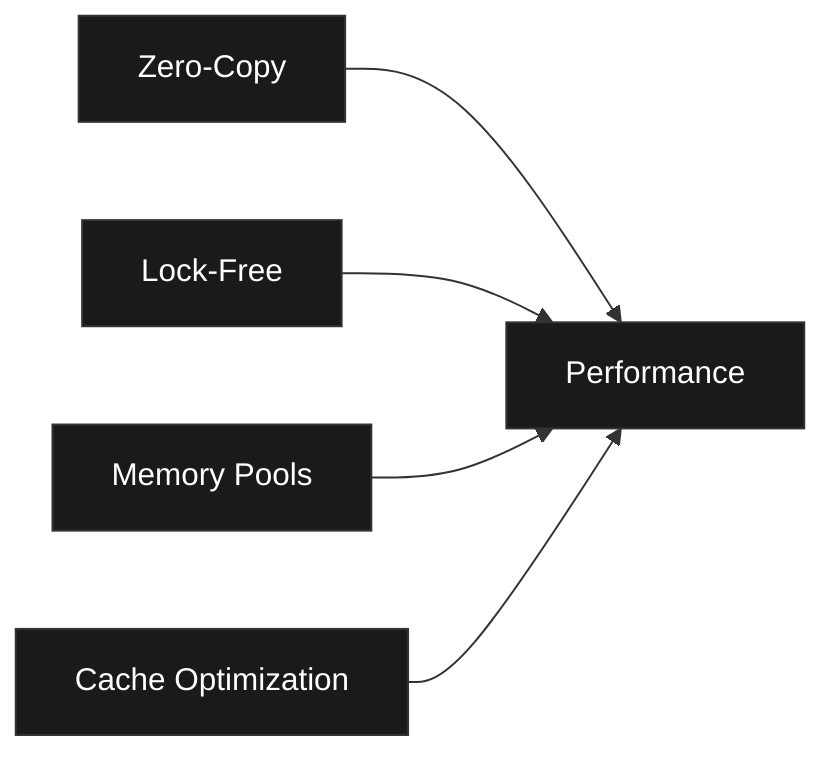

# Trade-Ngin 🚀

A high-performance algorithmic trading system built in modern C++.

[]()
[]()
[]()

## System Architecture


```mermaid
graph TD
    A[Market Data Source] --> B[Database Client]
    B --> C[OHLCV Handler]
    C --> D[Strategy Layer]
    D --> E[Risk Engine]
    E --> F[Order Manager]
    F --> G[IBKR Interface]
    G --> H[Market]
    
    classDef default fill:#1a1a1a,stroke:#333,stroke-width:1px,color:#fff
```

## Key Features

- 🚄 High-performance market data processing
- 🛡️ Robust risk management
- 📊 Advanced position management
- 🔄 Automated trading strategies
- 📈 Real-time market data handling
- 🧪 Comprehensive testing suite

## Component Interaction


```mermaid
sequenceDiagram
    participant MD as Market Data
    participant S as Strategy
    participant R as Risk Engine
    participant O as Order Manager
    participant B as Broker

    MD->>S: Market Update
    S->>S: Generate Signal
    S->>R: Check Risk Limits
    R->>O: Approve Order
    O->>B: Submit Order
    B->>O: Order Status
    O->>S: Position Update
```

## Quick Start

### Prerequisites


```mermaid
graph LR
    A[C++ 17+] --> D[Trade-Ngin]
    B[CMake 3.10+] --> D
    C[Boost 1.75+] --> D
    E[PostgreSQL] --> D
    F[Arrow] --> D
    G[IBKR API] --> D
    
    classDef default fill:#1a1a1a,stroke:#333,stroke-width:1px,color:#fff
```

### Installation
(will need proper cmake setup until dockerized)
```bash
# Clone repository
git clone https://github.com/AlgoGators/trade-ngin.git

# Build
cd trade-ngin
mkdir build && cd build
cmake ..
make

# Run tests
./bin/test_ibkr_paper_trader
```

## Thread Model


```mermaid
graph LR
    A([Main Thread]) --> B[Strategy Execution]
    C([Data Thread]) --> D[Market Data Processing]
    E([Order Thread]) --> F[Order Management]
    G([Risk Thread]) --> H[Risk Calculations]
    I([Logging Thread]) --> J[Async Logging]
    
    classDef threadBox fill:#f0f0f0,stroke:#333,stroke-width:1px
    classDef processBox fill:#1a1a1a,stroke:#333,stroke-width:1px,color:#fff
    
    class A,C,E,G,I threadBox
    class B,D,F,H,J processBox
```

## Data Flow


```mermaid
flowchart TD
    A[Raw Market Data] --> B[Data Validation]
    B --> C[Arrow Conversion]
    C --> D[Strategy Processing]
    D --> E{Risk Check}
    E -->|Pass| F[Order Generation]
    E -->|Fail| G[Risk Alert]
    F --> H[Order Execution]
    H --> I[Position Update]
    
    classDef default fill:#1a1a1a,stroke:#333,stroke-width:1px,color:#fff
```

## Development

### Directory Structure
```
trade_ngin/
├── docs/                 # Documentation
├── tests/               # Test suite
├── trade_ngin/          # Source code
│   ├── data/           # Data handling
│   ├── strategy/       # Trading strategies
│   └── system/         # Core system
└── scripts/            # Build & utility scripts
```

### Building for Development


```mermaid
graph TD
    A[CMake Configure] --> B[Build]
    B --> C[Run Tests]
    C --> D{Tests Pass?}
    D -->|Yes| E[Deploy]
    D -->|No| F[Debug]
    F --> B
    
    classDef default fill:#1a1a1a,stroke:#333,stroke-width:1px,color:#fff
```

## Contributing

1. Fork the repository
2. Create your feature branch (`git checkout -b feature/amazing-feature`)
3. Commit your changes (`git commit -m 'Add amazing feature'`)
4. Push to the branch (`git push origin feature/amazing-feature`)
5. Open a Pull Request

## Documentation

- [New Developer Guide](docs/new_dev_docs.md)
- [System Reference](docs/system_overview.md)
- [CMake Setup](docs/CTest.md) + gpt lol

## Performance


```mermaid
graph LR
    A[Zero-Copy] --> E[Performance]
    B[Lock-Free] --> E
    C[Memory Pools] --> E
    D[Cache Optimization] --> E
    
    classDef default fill:#1a1a1a,stroke:#333,stroke-width:1px,color:#fff
```

## License

X

## Acknowledgments

- Interactive Brokers API
- Apache Arrow Project
- Boost Libraries
- PostgreSQL

## Support

For support, please check:
1. [Documentation](docs/)
2. [Issue Tracker](issues/) -- coming soon
3. [Discussions](discussions/) -- coming soon

---
Enjoy Building!