# trade-ngin
[]()
[]()
[](https://www.gnu.org/licenses/gpl-3.0)

## 📖 Project Overview

trade-ngin is a high-performance, modular quantitative trading system built in C++20 designed for professional algorithmic traders and financial institutions. The system supports systematic trading strategies with a focus on futures trading, featuring comprehensive risk management, portfolio optimization, and realistic backtesting capabilities.

### Core Capabilities

- **Multi-strategy portfolio management** with dynamic capital allocation and optimization
- **Comprehensive risk management** with VaR constraints, position limits, and drawdown control
- **High-performance backtesting engine** with realistic execution simulation and slippage modeling
- **Fixed-point arithmetic** using custom Decimal class for financial precision
- **PostgreSQL integration** with Apache Arrow for efficient data processing
- **Modular, component-based architecture** designed for extensibility and performance
- **Professional-grade C++20 implementation** with comprehensive error handling

The system is currently optimized for backtesting with a focus on futures trading strategies, featuring realistic execution simulation and comprehensive performance analytics. The architecture supports future live trading extensions with a unified codebase design.

## 🚦 Quick Ops Docs
- Performance & upkeep (CI/CD, testing, cron): `docs/performance_upkeep.md`
- Live pipeline specification: `docs/live_pipeline_spec.md`

## 🎯 Current System State

### Implemented Features
- ✅ **Multi-timeframe trend following strategy** with EMA crossovers across 6 timeframes
- ✅ **28 futures contracts** support (ES, NQ, GC, CL, ZN, etc.)
- ✅ **Fixed-point arithmetic** with custom Decimal class for financial precision
- ✅ **PostgreSQL integration** with Apache Arrow for efficient data processing
- ✅ **Comprehensive risk management** with VaR constraints and position limits
- ✅ **Dynamic portfolio optimization** with transaction cost considerations
- ✅ **Realistic backtesting** with slippage models and execution simulation
- ✅ **Extensive logging and debugging** capabilities

### Current Configuration
- **Initial Capital**: $500,000
- **Strategy**: Multi-timeframe trend following with volatility targeting (20% annualized)
- **EMA Windows**: {2,8}, {4,16}, {8,32}, {16,64}, {32,128}, {64,256}
- **Risk Parameters**: IDM=2.5, FDM=1.0-1.26, 3% weight per symbol
- **Leverage Limits**: 4.0x gross, 2.0x net exposure

### Development Status
- **Branch**: `refactor` (active development)
- **Language**: C++20 with modern features
- **Recent Focus**: Type safety improvements, fixed-point arithmetic, memory management
- **Testing**: Comprehensive unit tests with GoogleTest framework

## 📂 Repository Structure & Organization

```
trade_ngin/
├── apps/                       # Application executables
│   ├── backtest/               # Backtesting applications
│   │   ├── bt_trend.cpp        # Trend following strategy backtest
│   │   ├── results/            # Backtest result outputs
│   │   └── CMakeLists.txt      # Build configuration for backtests
│   ├── strategies/             # Live trading applications
│   │   ├── live_trend.cpp      # Live trend following strategy
│   │   └── CMakeLists.txt      # Build configuration for live strategies
│   └── CMakeLists.txt          # Build configuration for applications
├── include/                    # Public header files
│   └── trade_ngin/             # Main include directory
│       ├── backtest/           # Backtesting components
│       │   ├── backtest_engine.hpp
│       │   ├── slippage_models.hpp
│       │   └── transaction_cost_analysis.hpp
│       ├── core/               # Core system components
│       │   ├── config_base.hpp
│       │   ├── config_manager.hpp
│       │   ├── config_version.hpp
│       │   ├── error.hpp
│       │   ├── logger.hpp
│       │   ├── state_manager.hpp
│       │   ├── time_utils.hpp
│       │   └── types.hpp
│       ├── data/               # Data management
│       │   ├── conversion_utils.hpp
│       │   ├── credential_store.hpp
│       │   ├── database_interface.hpp
│       │   ├── database_pooling.hpp
│       │   ├── market_data_bus.hpp
│       │   └── postgres_database.hpp
│       ├── execution/          # Order execution
│       │   └── execution_engine.hpp
│       ├── instruments/        # Financial instruments
│       │   ├── equity.hpp
│       │   ├── futures.hpp
│       │   ├── instrument.hpp
│       │   ├── instrument_registry.hpp
│       │   └── option.hpp
│       ├── optimization/       # Portfolio optimization
│       │   └── dynamic_optimizer.hpp
│       ├── order/              # Order management
│       │   └── order_manager.hpp
│       ├── portfolio/          # Portfolio management
│       │   └── portfolio_manager.hpp
│       ├── risk/               # Risk management
│       │   └── risk_manager.hpp
│       └── strategy/           # Strategy components
│           ├── base_strategy.hpp
│           ├── regime_detector.hpp
│           ├── strategy_interface.hpp
│           ├── trend_following.hpp
│           └── types.hpp
├── src/                        # Implementation files
│   ├── backtest/               # Backtesting implementations
│   │   ├── backtest_engine.cpp
│   │   ├── slippage_model.cpp
│   │   └── transaction_cost_analysis.cpp
│   ├── core/                   # Core system implementations
│   │   ├── config_base.cpp
│   │   ├── config_manager.cpp
│   │   ├── config_version.cpp
│   │   ├── logger.cpp
│   │   └── state_manager.cpp
│   ├── data/                   # Data management implementations
│   │   ├── conversion_utils.cpp
│   │   ├── credential_store.cpp
│   │   ├── database_pooling.cpp
│   │   ├── market_data_bus.cpp
│   │   └── postgres_database.cpp
│   ├── execution/              # Order execution implementations
│   │   └── execution_engine.cpp
│   ├── instruments/            # Financial instruments implementations
│   │   ├── equity.cpp
│   │   ├── futures.cpp
│   │   ├── instrument_registry.cpp
│   │   └── option.cpp
│   ├── optimization/           # Portfolio optimization implementations
│   │   └── dynamic_optimizer.cpp
│   ├── order/                  # Order management implementations
│   │   └── order_manager.cpp
│   ├── portfolio/              # Portfolio management implementations
│   │   └── portfolio_manager.cpp
│   ├── risk/                   # Risk management implementations
│   │   └── risk_manager.cpp
│   └── strategy/               # Strategy implementations
│       ├── base_strategy.cpp
│       ├── regime_detector.cpp
│       └── trend_following.cpp
├── tests/                      # Unit and integration tests
│   ├── backtesting/            # Backtest component tests
│   │   ├── test_engine.cpp
│   │   └── test_transaction_cost_analysis.cpp
│   ├── core/                   # Core component tests
│   │   ├── test_base.hpp
│   │   ├── test_config_base.cpp
│   │   ├── test_config_manager.cpp
│   │   ├── test_config_version.cpp
│   │   ├── test_logger.cpp
│   │   ├── test_result.cpp
│   │   └── test_state_manager.cpp
│   ├── data/                   # Data component tests
│   │   ├── test_credential_store.cpp
│   │   ├── test_database_pooling.cpp
│   │   ├── test_db_utils.cpp
│   │   ├── test_db_utils.hpp
│   │   ├── test_market_data_bus.cpp
│   │   └── test_postgres_database.cpp
│   ├── execution/              # Execution component tests
│   │   └── test_execution_engine.cpp
│   ├── optimization/           # Optimization component tests
│   │   └── test_dynamic_optimizer.cpp
│   ├── order/                  # Order component tests
│   │   ├── test_order_manager.cpp
│   │   ├── test_utils.cpp
│   │   └── test_utils.hpp
│   ├── portfolio/              # Portfolio component tests
│   │   ├── mock_strategy.hpp
│   │   └── test_portfolio_manager.cpp
│   ├── risk/                   # Risk component tests
│   │   └── test_risk_manager.cpp
│   ├── strategy/               # Strategy component tests
│   │   ├── test_base_strategy.cpp
│   │   └── test_trend_following.cpp
│   └── CMakeLists.txt          # Build configuration for tests
├── build/                      # Build directory (generated)
├── linting/                    # Code quality and linting tools
│   ├── auto_fix_lint.sh
│   ├── lint_runner.sh
│   └── lint_report_*.txt       # Generated lint reports
├── logs/                       # Application logs (generated)
├── cmake/                      # CMake modules and configurations
│   └── modules/
│       └── Findlibpqxx.cmake
├── config/                     # Environment-specific configurations
│   ├── development/
│   └── production/
├── externals/                  # Third-party dependencies (GoogleTest)
├── build_and_test.sh           # Automated build and test script
├── build_docker.sh             # Docker build script
├── CMakeLists.txt              # Main build configuration
├── config.json                 # Active configuration file
├── config_template.json        # Template for configuration files
├── TYPE_CONVERSION_GUIDE.md    # Guide for Decimal/Price/Quantity types
├── README.Docker.md            # Docker setup documentation
├── Dockerfile                  # Docker container configuration
└── CLAUDE.md                   # Project knowledge base and current state
```

## ⚙️ System Architecture & Component Breakdown

trade-ngin follows a modular, component-based architecture with interfaces between system components. Here's a detailed breakdown of the major components:

### Core System Components

#### Error Handling System (`error.hpp`)
- Defines custom error codes via `ErrorCode` enum
- Implements `TradeError` class extending `std::runtime_error`
- Provides `Result<T>` template for error propagation throughout the system
- Supports `make_error<T>()` for creating standardized error responses

#### Logging Framework (`logger.hpp`, `logger.cpp`)
- Singleton implementation for system-wide logging
- Configurable log levels (TRACE, DEBUG, INFO, WARNING, ERROR, FATAL)
- Multiple output destinations (console, file, or both)
- Automatic log rotation based on file size
- Thread-safe implementation with mutex protection

#### State Management (`state_manager.hpp`, `state_manager.cpp`)
- Tracks component states throughout the system
- Supports state transitions with validation
- Maintains component metrics and diagnostics
- Enables system-wide health monitoring

#### Configuration Management
- `ConfigBase` - Base class for serializable configurations
- `ConfigManager` - Centralized configuration management
- `ConfigVersion` - Version tracking and migration support
- Environment-specific configuration overrides (dev, staging, prod, backtest)

### Data Management Components

#### Database Interface
- Abstract `DatabaseInterface` defining common database operations
- PostgreSQL implementation via `PostgresDatabase`
- Arrow-based data type support for efficient memory management
- Query building and parameter sanitization

#### Market Data Bus
- Publish-subscribe pattern for market data distribution
- Event-based architecture with callback registration
- Symbol and event type filtering
- Thread-safe implementation

#### Data Conversion Utilities
- Arrow table to/from domain objects conversion
- Type-safe timestamp handling
- Error handling with Result pattern

### Financial Instruments

#### Instrument Interface
- Abstract base class defining common instrument properties
- Asset-specific implementations:
  - `EquityInstrument` - Stocks, ETFs
  - `FuturesInstrument` - Futures contracts
  - `OptionInstrument` - Options with Greeks calculation

### Order Management

#### Order Manager
- Order lifecycle management (creation, submission, cancellation)
- Order book maintenance for status tracking
- Validation and error handling
- Commission calculation

### Execution Engine

- Algorithm-based order execution (TWAP, VWAP, PoV, etc.)
- Execution metrics tracking and analysis
- Position buffering to reduce unnecessary trading
- Custom algorithm extensibility

### Strategy Framework

#### Strategy Interface
- Abstract interface for all trading strategies
- Lifecycle management (init, start, stop, pause, resume)
- Event handling (market data, executions, signals)
- Position and risk management

#### Base Strategy
- Common implementation of strategy interface
- Position tracking and management
- Signal generation and execution
- Risk limit enforcement

#### Strategy Implementations
- `TrendFollowingStrategy` - Multi-timeframe trend following using EMA crossovers
- Extensible framework for adding new strategies


### Risk Management

- Position-level and portfolio-level risk constraints
- Value at Risk (VaR) calculation
- Jump risk monitoring
- Maximum drawdown limits
- Leverage constraints
- Correlation risk monitoring

### Portfolio Management

- Multi-strategy portfolio construction
- Dynamic capital allocation
- Position aggregation and netting
- Portfolio-level optimizations and constraints

### Backtesting Framework

#### Backtest Engine
- Historical market data simulation
- Event-driven architecture
- Realistic execution modeling
- Comprehensive performance metrics
- Transaction cost analysis

#### Slippage Models
- Volume-based slippage
- Spread-based slippage
- Custom slippage model extensibility

#### Transaction Cost Analysis
- Execution quality evaluation
- Implementation shortfall calculation
- Benchmark comparison (VWAP, TWAP, arrival price)
- Cost breakdown (spread, market impact, timing, delay)

### Portfolio Optimization

#### Dynamic Optimizer
- Position optimization considering transaction costs
- Risk constraints enforcement
- Tracking error minimization
- Convex optimization techniques

```mermaid
classDiagram
    class ConfigBase {
        <<abstract>>
        +save_to_file(filepath) Result~void~
        +load_from_file(filepath) Result~void~
        +to_json() json
        +from_json(json) void
    }
    
    class StrategyConfig {
        +capital_allocation double
        +max_leverage double
        +position_limits map
        +max_drawdown double
        +trading_params map
        +to_json() json
        +from_json(json) void
    }
    
    class PortfolioConfig {
        +total_capital double
        +reserve_capital double
        +use_optimization bool
        +use_risk_management bool
        +to_json() json
        +from_json(json) void
    }

    class RiskConfig {
        +var_limit double
        +jump_risk_limit double
        +max_correlation double
        +to_json() json
        +from_json(json) void
    }
    
    class DynamicOptConfig {
        +tau double
        +capital double
        +max_iterations int
        +to_json() json
        +from_json(json) void
    }
    
    class BacktestConfig {
        +strategy_config StrategyConfig
        +portfolio_config PortfolioConfig
        +results_db_schema string
        +to_json() json
        +from_json(json) void
    }
    
    class DatabaseInterface {
        <<interface>>
        +connect() Result~void~
        +disconnect() void
        +is_connected() bool
        +get_market_data(...) Result~Table~
        +store_executions(...) Result~void~
        +store_positions(...) Result~void~
        +store_signals(...) Result~void~
        +get_symbols(...) Result~string[]~
    }
    
    class PostgresDatabase {
        -connection_string string
        -connection pqxx::connection
        +connect() Result~void~
        +disconnect() void
        +is_connected() bool
        +get_market_data(...) Result~Table~
    }
    
    class StrategyInterface {
        <<interface>>
        +initialize() Result~void~
        +start() Result~void~
        +stop() Result~void~
        +pause() Result~void~
        +resume() Result~void~
        +on_data(data) Result~void~
        +on_execution(report) Result~void~
        +on_signal(symbol, signal) Result~void~
        +get_positions() Position[]
    }
    
    class BaseStrategy {
        #id_ string
        #config_ StrategyConfig
        #positions_ map
        #state_ StrategyState
        +initialize() Result~void~
        +on_data(data) Result~void~
        +check_risk_limits() Result~void~
    }
    
    class TrendFollowingStrategy {
        -trend_config_ TrendFollowingConfig
        -price_history_ map
        -volatility_history_ map
        +on_data(data) Result~void~
        -calculate_ewma(...) vector~double~
        -get_raw_forecast(...) vector~double~
        -calculate_position(...) double
    }
    
    class Instrument {
        <<interface>>
        +get_symbol() string
        +get_type() AssetType
        +is_tradeable() bool
        +get_margin_requirement() double
        +round_price(price) double
    }
    
    class SlippageModel {
        <<interface>>
        +calculate_slippage(...) double
        +update(market_data) void
    }
    
    ConfigBase <|-- StrategyConfig
    ConfigBase <|-- PortfolioConfig
    ConfigBase <|-- RiskConfig
    ConfigBase <|-- DynamicOptConfig
    ConfigBase <|-- BacktestConfig
    
    DatabaseInterface <|-- PostgresDatabase
    
    StrategyInterface <|-- BaseStrategy
    BaseStrategy <|-- TrendFollowingStrategy
    
    SlippageModel <|-- VolumeSlippageModel
    SlippageModel <|-- SpreadSlippageModel
```



## 🔄 Workflow & System Flow

### Backtesting Workflow

1. **Initialization**
   - Load configuration from files
   - Initialize database connection
   - Create strategy instances
   - Initialize portfolio manager
   - Configure risk management and optimization components

2. **Market Data Loading**
   - Query historical data from database
   - Convert to internal Bar representation
   - Group data by timestamp for realistic simulation

3. **Strategy Processing**
   - Feed market data to strategies chronologically
   - Generate trading signals based on strategy logic
   - Convert signals to position targets

4. **Portfolio-Level Processing**
   - Aggregate positions across strategies
   - Apply risk management constraints
   - Apply position optimization if enabled
   - Calculate trade sizes based on current vs. target positions

5. **Order Execution Simulation**
   - Apply slippage models to execution prices
   - Calculate transaction costs
   - Generate execution reports
   - Update positions based on fills

6. **Performance Tracking**
   - Update equity curve
   - Calculate drawdowns
   - Track risk metrics over time
   - Record trade statistics

7. **Results Analysis**
   - Calculate performance metrics (Sharpe, Sortino, etc.)
   - Analyze transaction costs
   - Generate visualizations and reports
   - Save results to database

### Live Trading Workflow

1. **Initialization**
   - Load configuration from files
   - Initialize broker connections
   - Create strategy instances
   - Initialize portfolio manager
   - Configure risk management and optimization components

2. **Market Data Subscription**
   - Subscribe to real-time market data feeds
   - Process incoming ticks/bars
   - Update internal market data state

3. **Strategy Processing**
   - Feed real-time data to strategies
   - Generate trading signals based on strategy logic
   - Convert signals to position targets

4. **Portfolio-Level Processing**
   - Aggregate positions across strategies
   - Apply risk management constraints
   - Apply position optimization if enabled
   - Calculate trade sizes based on current vs. target positions

5. **Order Execution**
   - Submit orders to execution engine
   - Select appropriate execution algorithm
   - Route orders to broker/exchange
   - Monitor order status and fills

6. **Position Management**
   - Track current positions and exposures
   - Calculate realized and unrealized P&L
   - Enforce risk limits in real-time

7. **Monitoring and Reporting**
   - Track system health and component states
   - Generate performance reports
   - Log diagnostics and metrics

## 🛠️ Setup, Installation & Building Instructions

### Prerequisites

- **C++20 compatible compiler** (GCC 10+, Clang 10+, MSVC 2019+)
- **CMake 3.17 or higher**
- **PostgreSQL 12+** (for market data storage)
- **Docker** (optional, for containerized deployment)
- **Required libraries**:
  - nlohmann_json (JSON configuration handling)
  - Apache Arrow C++ (efficient data processing and columnar storage)
  - libpqxx (PostgreSQL connectivity)
  - GoogleTest (included in `externals/` - testing framework)

### System Requirements

- **Memory**: Minimum 8GB RAM for typical backtests (28 contracts, 2 years data)
- **Storage**: SSD recommended for database performance
- **Database**: PostgreSQL instance with market data properly indexed
- **OS**: Linux (preferred), Windows (WSL2 recommended), macOS

### Clone the Repository

```bash
git clone https://github.com/your-organization/trade_ngin.git
cd trade_ngin
```

### Setup Database

1. Create a PostgreSQL database for market data and strategy results
2. Create the necessary schemas and tables
3. Configure database credentials:
   ```bash
   cp config_template.json config.json
   # Edit config.json with your database credentials
   ```

### Building with CMake

#### Option 1: Manual Build
```bash
# Create build directory
mkdir build && cd build

# Configure CMake
cmake ..

# Build the library and applications
cmake --build . --config Release

# Run tests
ctest -C Release
```

#### Option 2: Automated Build Script
```bash
# Use the provided build and test script
./build_and_test.sh
```

#### Option 3: Docker Build
```bash
# Build Docker container
./build_docker.sh

# Or manually with Docker
docker build -t trade-ngin .
docker run -it trade-ngin
```

### Building with Visual Studio

1. Open the project folder in Visual Studio
2. Select "Open CMake Project"
3. Choose the desired configuration (Debug/Release)
4. Build the solution

### Building with CLion

1. Open the project folder in CLion
2. CLion should automatically detect the CMake configuration
3. Choose the desired build configuration
4. Click "Build" to compile the project

## 🚀 Running the System

### Running Backtests

```bash
# From the build directory
./bin/Release/bt_trend

# Or from project root
./build/apps/backtest/bt_trend
```

### Running Live Trading

```bash
# From the build directory  
./bin/Release/live_trend

# Or from project root
./build/apps/strategies/live_trend
```

### Monitoring and Logs

```bash
# View real-time logs
tail -f logs/bt_trend_*.log

# Run linting checks
./linting/lint_runner.sh

# View lint reports
cat linting/lint_report_*.txt
```

### Configuration Parameters

All components in trade-ngin are configurable through JSON configuration files:

#### Backtest Configuration

```json
{
  "strategy_config": {
    "symbols": ["ES", "NQ", "CL", "GC"],
    "asset_class": 0,
    "data_freq": 0,
    "data_type": "ohlcv",
    "start_date": "1609459200",
    "end_date": "1640995200",
    "initial_capital": 1000000.0,
    "commission_rate": 0.0005,
    "slippage_model": 1.0,
    "store_trade_details": true
  },
  "portfolio_config": {
    "initial_capital": 1000000.0,
    "use_risk_management": true,
    "use_optimization": true,
    "risk_config": {
      "var_limit": 0.15,
      "jump_risk_limit": 0.10,
      "max_correlation": 0.7,
      "max_gross_leverage": 4.0,
      "max_net_leverage": 2.0,
      "confidence_level": 0.99,
      "lookback_period": 252,
      "capital": 1000000.0
    },
    "opt_config": {
      "tau": 1.0,
      "capital": 1000000.0,
      "asymmetric_risk_buffer": 0.1,
      "cost_penalty_scalar": 10,
      "max_iterations": 1000,
      "convergence_threshold": 1e-6
    }
  },
  "results_db_schema": "backtest_results"
}
```

#### Strategy Configuration

```json
{
  "capital_allocation": 1000000.0,
  "max_leverage": 3.0,
  "max_drawdown": 0.3,
  "var_limit": 0.1,
  "correlation_limit": 0.7,
  "trading_params": {
    "ES": 50.0,
    "NQ": 20.0,
    "CL": 1000.0,
    "GC": 100.0
  },
  "position_limits": {
    "ES": 100,
    "NQ": 100,
    "CL": 50,
    "GC": 50
  },
  "save_executions": true,
  "save_signals": true,
  "save_positions": true
}
```

## 🔍 Extending & Contributing to the System

### Adding New Strategies

To create a new strategy, follow these steps:

1. Create a new header file in `include/trade_ngin/strategy/`
2. Create a new implementation file in `src/strategy/`
3. Inherit from `BaseStrategy` or implement `StrategyInterface` directly
4. Implement the required methods for your strategy logic
5. Register your strategy with the portfolio manager

Example of a minimally viable strategy:

```cpp
class MyStrategy : public BaseStrategy {
public:
    MyStrategy(std::string id, StrategyConfig config, std::shared_ptr<DatabaseInterface> db)
        : BaseStrategy(std::move(id), std::move(config), std::move(db)) {
        // Initialize strategy-specific parameters
    }

    Result<void> on_data(const std::vector<Bar>& data) override {
        // Call base class implementation first
        auto base_result = BaseStrategy::on_data(data);
        if (base_result.is_error()) return base_result;

        // Implement your strategy logic here
        // Generate signals and update positions

        return Result<void>();
    }

    Result<void> initialize() override {
        // Custom initialization logic
        auto base_result = BaseStrategy::initialize();
        if (base_result.is_error()) return base_result;

        // Additional initialization steps

        return Result<void>();
    }
};
```

### Adding New Data Sources

To integrate a new data source:

1. Implement a new class derived from `DatabaseInterface`
2. Override all abstract methods to interact with your data source
3. Implement conversion from your data source's format to trade-ngin's internal types

### Adding New Execution Algorithms

To add a new execution algorithm:

1. Update the `ExecutionAlgo` enum in `execution_engine.hpp`
2. Implement a new method in `ExecutionEngine` for your algorithm
3. Update the `submit_execution` method to handle your new algorithm

### Contribution Guidelines

1. **Code Style**
   - Follow the existing coding style and naming conventions
   - Use snake_case for member variables and method names
   - Use PascalCase for class names
   - Use snake_case for file names

2. **Error Handling**
   - Use the `Result<T>` pattern for functions that can fail
   - Provide detailed error messages with component context

3. **Testing**
   - Write tests for all new functionality
   - Ensure all tests pass before submitting a pull request

4. **Documentation**
   - Document all public interfaces with clear descriptions
   - Update relevant README sections for significant changes

## 🛡️ Error Handling & Troubleshooting

### Common Error Codes

- `ErrorCode::INVALID_ARGUMENT` - Invalid parameter provided
- `ErrorCode::NOT_INITIALIZED` - Component used before initialization
- `ErrorCode::DATABASE_ERROR` - Database connection or query error
- `ErrorCode::DATA_NOT_FOUND` - Requested data not found
- `ErrorCode::INVALID_DATA` - Data validation failed
- `ErrorCode::CONVERSION_ERROR` - Type conversion error
- `ErrorCode::ORDER_REJECTED` - Order rejected by the system
- `ErrorCode::INSUFFICIENT_FUNDS` - Insufficient capital for order
- `ErrorCode::POSITION_LIMIT_EXCEEDED` - Position limit exceeded
- `ErrorCode::INVALID_ORDER` - Invalid order parameters
- `ErrorCode::STRATEGY_ERROR` - Error in strategy logic
- `ErrorCode::RISK_LIMIT_EXCEEDED` - Risk limit exceeded


### Troubleshooting Techniques

#### Database Connection Issues

If you encounter database connection issues:

1. Verify your credentials in `config.json`
2. Ensure the PostgreSQL server is running
3. Check network connectivity and firewall settings
4. Examine the error message from `PostgresDatabase::connect()`

Example of handling database errors:

```cpp
auto db = std::make_shared<PostgresDatabase>(connection_string);
auto connect_result = db->connect();
if (connect_result.is_error()) {
    // Handle error case
    std::cerr << "Database connection error: " << connect_result.error()->what() << std::endl;
    std::cerr << "Error code: " << static_cast<int>(connect_result.error()->code()) << std::endl;
    return 1;
}
```

#### Strategy Initialization Failures

If a strategy fails to initialize:

1. Check that the database connection is valid
2. Verify that the strategy configuration is complete
3. Look for specific error messages in the initialization chain
4. Examine the strategy's `initialize()` method

#### Unrealistic Backtest Results (FIXED - Dec 2024)

**If you see static portfolio values or impossible metrics**:

1. **Static $500k Portfolio Value**:
   - **Cause**: Data ordering issue (symbol-first vs time-first)
   - **Check**: Look for "Available current prices for X symbols" in logs
   - **Expected**: Should show 28 symbols, not 8-13
   - **Status**: FIXED in latest version

2. **Impossible Metrics** (Sortino=999, MaxDD=0%):
   - **Cause**: No position changes or P&L calculation errors  
   - **Check**: Monitor "Period executions count" and position updates
   - **Expected**: Should see varying execution counts (8-28 per period)
   - **Status**: FIXED in latest version

3. **Missing Data Warnings**:
   - **Message**: "No current price available for position X"
   - **Cause**: Normal for holidays/weekends, concerning if frequent
   - **Action**: Monitor frequency - occasional is normal

#### Backtesting Performance Issues

If backtests are running slowly:

1. Reduce the number of symbols or date range
2. Check for inefficient loops or calculations in strategies  
3. Optimize database queries to fetch data more efficiently
4. Consider using release builds instead of debug builds
5. Use automated build script `./build_and_test.sh` for optimized builds

#### Memory Management Issues

If you encounter memory issues:

1. Look for resource leaks in components with manual memory management
2. Ensure that destructors properly clean up allocated resources
3. Check for memory-intensive operations in tight loops
4. Consider using memory profiling tools like Valgrind

## 📊 Performance Considerations & Optimizations

### Data Processing Optimization

trade-ngin uses Apache Arrow for efficient in-memory data representation:

- Zero-copy data sharing between components
- Columnar memory layout for efficient processing
- Vectorized operations for performance
- Minimal memory allocations during data processing

### Concurrency Model

- Components use thread-safe designs with mutex protection
- The market data bus implements a publish-subscribe pattern for efficient event distribution
- Strategy processing can be parallelized for multiple instruments

### Memory Management

- RAII pattern throughout the codebase
- Smart pointers for automatic resource management
- Preallocated buffers for high-performance operations
- Limited heap allocations in performance-critical paths

### Performance Profiling

To profile trade-ngin performance:

1. Build with profiling flags enabled
   ```bash
   cmake -DCMAKE_BUILD_TYPE=RelWithDebInfo -DENABLE_PROFILING=ON ..
   ```

2. Run with profiling tools
   ```bash
   # Linux
   valgrind --tool=callgrind ./bin/bt_trend
   
   # Windows
   Visual Studio Profiler
   ```

## 📌 Best Practices & Coding Standards

### Naming Conventions

- **Classes**: PascalCase (e.g., `OrderManager`)
- **Methods**: snake_case (e.g., `add_strategy`)
- **Variables**: snake_case (e.g., `update_allocations`)
- **Constants**: UPPER_CASE (e.g., `MAX_ORDERS`)
- **Files**: snake_case (e.g., `order_manager.cpp`)

### Error Handling

- Use `Result<T>` for functions that can fail
- Avoid throwing exceptions across component boundaries
- Provide detailed error messages with context
- Check all return values for errors

Example of proper error handling:

```cpp
Result<void> MyComponent::doSomething() {
    auto result = dependentComponent_->operation();
    if (result.is_error()) {
        return make_error<void>(
            result.error()->code(),
            "Failed during operation: " + std::string(result.error()->what()),
            "MyComponent"
        );
    }
    
    // Continue with operation
    return Result<void>();
}
```

### Memory Management

- Use smart pointers (`std::shared_ptr`, `std::unique_ptr`)
- Follow RAII principles
- Avoid raw `new`/`delete` operations
- Be mindful of ownership semantics

### Documentation

- Document all public interfaces
- Include parameter descriptions
- Document preconditions and postconditions
- Document error conditions and handling

## 📚 Additional Documentation

- **CLAUDE.md** - Comprehensive project knowledge base with current system state, recent fixes, and development priorities
- **TYPE_CONVERSION_GUIDE.md** - Guide for proper handling of Decimal, Price, and Quantity types
- **README.Docker.md** - Docker setup and deployment instructions  
- **linting/** - Code quality tools and style guides

For detailed information about recent changes, debugging procedures, and development workflows, consult **CLAUDE.md** which is actively maintained with the latest project status.

## 📖 License & Usage Terms

trade-ngin is licensed under the [GPL v3](https://www.gnu.org/licenses/gpl-3.0) License. See LICENSE file for details.

Third-party dependencies:
- nlohmann_json: MIT License
- Apache Arrow: Apache License 2.0
- libpqxx: BSD License
- GoogleTest: BSD 3-Clause License (included in externals/)
