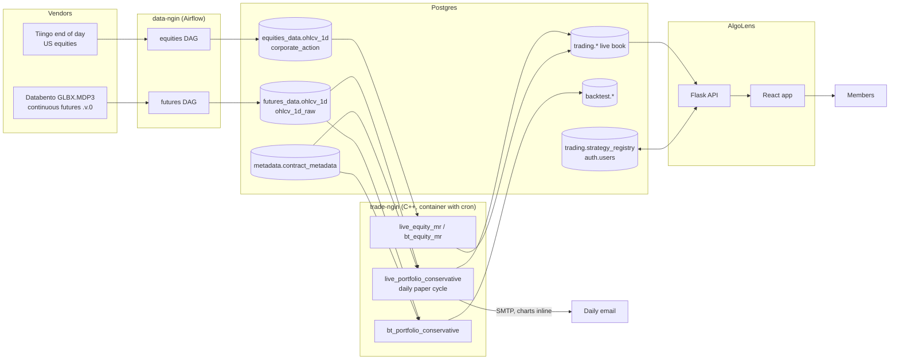
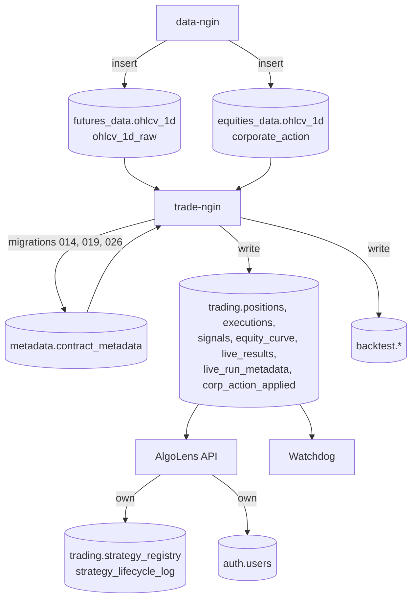
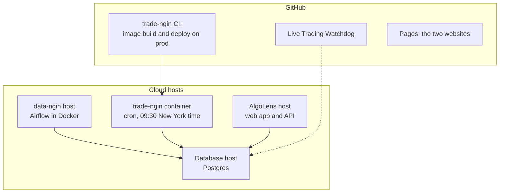

# System architecture

What the AlgoGators system is made of, what each part does, and how the parts connect. The engine
(this repository, trade-ngin) is described in most detail and every statement about it is checked
against the code here. The other repositories are described at the level of what they are and what
they read and write; their own READMEs are the authority for anything deeper.

Specialised documents carry the detail this map only points at:

| Topic | Document |
|---|---|
| Which tables and columns to read, and which never to read | [DATA_SOURCES_OF_TRUTH.md](DATA_SOURCES_OF_TRUTH.md) |
| The daily live run, its dates, its tables and its running instructions | [LIVE_RUN_CYCLE.md](LIVE_RUN_CYCLE.md) |
| The trend-following method end to end | [TREND_FOLLOWING_SYSTEM.md](TREND_FOLLOWING_SYSTEM.md) |
| The futures rebalance: sizing capital, overlay, the one pass | [OPTIMIZER_AND_RISK_DESIGN.md](OPTIMIZER_AND_RISK_DESIGN.md) |
| Risk modules and `risk.json` | [RISK_MODULES.md](RISK_MODULES.md) |
| Contract rolls and the back-adjusted series | [FUTURES_ROLLS.md](FUTURES_ROLLS.md) |
| What a fill costs, fees and netting | [COST_MODEL.md](COST_MODEL.md) |
| Configuration files | [CONFIG_GUIDE.md](CONFIG_GUIDE.md) |
| Operations: schedule, exit codes, logs, migrations | [performance_upkeep.md](performance_upkeep.md) |
| Equity cost basis and corporate actions | [AVERAGE_PRICE_LIFECYCLE.md](AVERAGE_PRICE_LIFECYCLE.md), [CORP_ACTIONS_DATA_BOUNDARY.md](CORP_ACTIONS_DATA_BOUNDARY.md), [BROKER_BASIS_RECONCILIATION.md](BROKER_BASIS_RECONCILIATION.md) |

Contents

1. The system in one picture
2. data-ngin: the data pipeline
3. The database
4. trade-ngin: the engine
5. The other repositories
6. How the pieces connect

---

## 1. The system in one picture

The fund runs on four things: a data pipeline, one Postgres database, a C++ engine and a dashboard.
Everything else is a tool, a library or a website.

Satellites, none of which touch the database above:

| Repository | What it is |
|---|---|
| algosystem | Python library: tearsheets and overfitting statistics on an equity series |
| AlgoTerminal | Python terminal workbench for research on free public data |
| algogauge | benchmark and profiling suite that compiles trade-ngin as a git submodule |
| the websites | a public marketing site and a training curriculum site, both static |

A day in the system:

| When | What runs | Where | Reads | Writes |
|---|---|---|---|---|
| early morning, before the engine | the futures and equities DAGs | data-ngin (Airflow) | the vendors | `futures_data.ohlcv_1d`, `ohlcv_1d_raw`; `equities_data.ohlcv_1d`, `ohlcv_1d_raw` |
| 09:30 America/New_York, every calendar day | `scripts/run_live_portfolio.sh`, which runs `live_portfolio_conservative <date> --send-email` | the trade-ngin container | bars, metadata, the stored book | `trading.*`, the email, CSV files, logs |
| 15:00 UTC, every day | the Live Trading Watchdog workflow | GitHub Actions | `trading.live_results`, `trading.positions`, `trading.live_run_metadata` | a GitHub issue when the book was not written or a run is marked |
| on demand | AlgoLens | its own host | `trading.*`, the registry | the registry and its lifecycle log |
| on demand | the backtest runners | a developer machine | bars, metadata | `backtest.*`, CSV files |

"Live" means a daily paper cycle. There is no broker connection anywhere in the system: fills are
synthesised from the change in the book and priced at a stored close (section 4.6).

---

## 2. data-ngin: the data pipeline

**What it is.** A Python pipeline with four configurable stages (loader, fetcher, cleaner, inserter)
driven by one YAML file per feed. Each YAML names the classes to load, the vendor, the symbol list,
the target `schema.table` and a date range. One Airflow DAG per feed wraps the pipeline run.

**Vendors and datasets.**

| Vendor | What it delivers | Target |
|---|---|---|
| Databento Historical, dataset `GLBX.MDP3`, schema OHLCV-1D, continuous symbology | one daily bar per root of the continuous symbol `ROOT.v.0` (for example `ZN.v.0`) | `futures_data.ohlcv_1d` and `ohlcv_1d_raw` |
| Tiingo end of day | daily OHLCV, the vendor's adjusted OHLCV, `div_cash` and `split_factor` per symbol | `equities_data.ohlcv_1d` and `ohlcv_1d_raw` |
| none (synthetic series) | test series | `synthetic.ohlcv_1d` (not present in every copy of the database; nothing in trade-ngin reads it) |

**Transformations.**

- Futures. `.v.0` is the vendor's volume-ranked front-contract resolver: each day's bar is the bar
  of whichever listed contract ranked first by volume, at that contract's own traded prices.
  Nothing is back-adjusted upstream, by the vendor or by the pipeline. On the day the resolver
  switches contract the stored close steps by the price gap between two contracts, which is not a
  return. The engine, not the pipeline, builds the back-adjusted series every return consumer reads
  (the design comment at `include/trade_ngin/data/roll_series.hpp:15`, and
  [FUTURES_ROLLS.md](FUTURES_ROLLS.md)). The contract behind each bar is the `instrument_id` column
  of `ohlcv_1d_raw`.
- Futures symbols. The four equity index roots are stored under the micro symbols (`MES.v.0`,
  `MNQ.v.0`, `MYM.v.0`, `M2K.v.0`); the price history is the index contract's, and the engine
  decides which contract size the book trades on each date (section 4.3).
- Equities. The vendor's raw and adjusted columns are stored as delivered. The engine does not read
  the vendor's adjusted columns: it rebuilds the adjustment from `div_cash` and `split_factor`
  (the comment at `include/trade_ngin/data/market_data_utils.hpp:13`).
- No trading calendar is generated. The engine carries its own holiday file
  (`include/trade_ngin/core/holidays.json`).

**Storage.** Plain inserts. `futures_data.ohlcv_1d_raw` has a primary key (`ts_event`, `symbol`)
and holds one row per symbol and day; `futures_data.ohlcv_1d` has no key and holds repeated rows,
which the engine's loader removes. The pipeline never creates a table. Its database connection
comes from its own environment.

What to read from these tables, the duplicate rows in `futures_data.ohlcv_1d` and the loader rule
that removes them are in [DATA_SOURCES_OF_TRUTH.md](DATA_SOURCES_OF_TRUTH.md).

---

## 3. The database

One PostgreSQL instance is the integration bus between the pipeline, the engine and the dashboard.
No service calls another: each reads and writes tables. Credentials come from each service's
environment or, for the engine, from the untracked `config/` directory (section 4.7).

| Schema | Tables the system uses | Written by | Schema changes in this repository |
|---|---|---|---|
| `futures_data` | `ohlcv_1d` (the bars the engine loads), `ohlcv_1d_raw` (one row per symbol and day, with `instrument_id`) | data-ngin | none |
| `equities_data` | `ohlcv_1d`, `ohlcv_1d_raw`, `corporate_action`, `ticker_aliases`, and coverage tables | data-ngin | `003` adds query indexes |
| `metadata` | `contract_metadata` (one row per futures contract: multiplier, tick, margins, hours, months, `"Fee Per Contract"`) | maintained by hand and by migrations | `014` adds `"Fee Per Contract"`, `019` corrects rows, `026` sets the per-contract IBKR fees with a CHECK |
| `trading` | `positions`, `executions`, `signals`, `equity_curve`, `live_results`, `live_run_metadata`, `strategy_trading_days_metadata`, `corp_action_applied`; function `get_trading_days` | trade-ngin live runners | `001` `portfolio_type`; `002`, `005`, `006` `corp_action_applied`; `004` `get_trading_days`; `012` `strategy_id` width; `013` `executions.netting_adjustment`; `015` `executions.execution_type` and `instrument_id`; `016` `positions.instrument_id`; `017` `live_results` roll costs; `020` `live_results.risk_detail` |
| `trading` | `strategy_registry`, `strategy_lifecycle_log` | AlgoLens | none |
| `backtest` | `run_metadata`, `results`, `equity_curve`, `final_positions`, `executions`; `signals` (present, never written) | trade-ngin backtest runners | `013`, `015` on `executions`; `016` `final_positions.instrument_id`; `018` `results` cost columns; `020` `equity_curve.risk_detail` |
| `auth` | `users` | AlgoLens | none |
| `synthetic` | `ohlcv_1d` (not present in every copy of the database; nothing in trade-ngin reads it) | data-ngin | none |
| `macro_data` | macro series | not by the engine; no runner reads it | none |

The migrations in `migrations/` are numbered 001 to 006, 012 to 020 and 026; each file's header is
its specification and each has a rollback file beside it. The core tables of `trading`, `backtest`,
`metadata` and `futures_data` predate the migrations: no migration creates them (the migration
test scripts build throwaway copies only), so the migrations only alter them. What one row of each
table is, its key and when it is final are in [LIVE_RUN_CYCLE.md](LIVE_RUN_CYCLE.md).

The bar table name is `{asset}_data.{data_type}_{frequency}` (`build_table_name`,
`include/trade_ngin/core/types.hpp:586`); the futures `_raw` twin is named by
`kFuturesRawBarTable` (`include/trade_ngin/data/market_data_utils.hpp:134`). The CI job "Schema
Ownership Guard" (`.github/workflows/ci-cd-pipeline.yml:506`) fails a change that adds, in
`src/data` or `src/storage`, a string literal beginning with `futures_data.`, `equities_data.`,
`options_data.`, `synthetic.`, `auth.` or `research.`. It is a pattern check on those two
directories: a schema named in the middle of a query, as the engine's read queries name
`equities_data`, is not matched.

Columns the engine stores that later sections refer to:

| Column | Where | Meaning |
|---|---|---|
| `execution_type` | `trading.executions`, `backtest.executions` | `STRATEGY` (a fill against the day's target), `ROLL` (one leg of a contract roll) or `BORROW` (the backtest's overnight borrow-fee row); `ExecutionType`, `include/trade_ngin/core/types.hpp:269` |
| `instrument_id` | the executions tables, `trading.positions`, `backtest.final_positions` | the vendor contract id: on a ROLL leg the contract that leg traded, on a position the contract held |
| `netting_adjustment` | the executions tables | the part of a sleeve fill's own cost the account did not pay because sleeves traded the same symbol on the same day (section 4.6) |
| `risk_scale`, `risk_detail` | `trading.live_results`, `backtest.equity_curve` (`risk_detail`) | the rebalance's record: nine keys built by `risk_detail_json`, `include/trade_ngin/risk/risk_detail.hpp:64` (`risk_requested`, `binding_term`, `overlay_blind`, `sizing_capital`, `account_value`, and the four `over_limit_*` keys) |
| `daily_roll_costs`, `total_roll_costs` | `trading.live_results` | the cost of ROLL legs, counted apart from strategy turnover |
| `transaction_costs`, `roll_costs`, `total_roll_fills` | `backtest.results` | the run's cost totals and its count of ROLL fills |
| `portfolio_config` | `trading.live_run_metadata` | the run's configuration as JSON, and the marks of a refused day (section 4.5) |

---

## 4. trade-ngin: the engine

### 4.1 What it is

One shared library, `trade_ngin` (`CMakeLists.txt:249`), plus eight runner executables and a
benchmark executable. It loads bars from Postgres, runs the strategies, sizes and rebalances a
portfolio in whole contracts under a risk overlay, synthesises the fills, and writes the book, the
fills, the P&L and the statistics back to Postgres. C++20, CMake.

### 4.2 Module map

Headers are under `include/trade_ngin/<module>/`, sources under `src/<module>/`. The design
comments at the top of the headers named here are the reference for each piece; this table only
says where to look.

| Module | Role | Start reading at |
|---|---|---|
| `core/` | layered JSON configuration (`config_loader`, `config_manager`), logger, `email_sender` (SMTP through libcurl), `chart_generator` (gnuplot, inline PNG), `holiday_checker` with `holidays.json`, `time_utils`, `types.hpp` (bars, positions, execution reports, asset class to schema) | `include/trade_ngin/core/config_loader.hpp:475` (`require_loop_keys`) |
| `data/` | `postgres_database` (every SQL read and write, libpqxx to Arrow tables), `credential_store`, `market_data_bus`, `market_data_utils` (the futures bar query that keeps one row per symbol and day; the equity adjustment), `session_classifier`, `roll_series`, `listing_dates` | `include/trade_ngin/data/market_data_utils.hpp:101` (`kFuturesBarKeepOrder`) |
| `data/session_classifier` | what one symbol's bar, or its absence, is on one date: `SESSION`, `JUNK`, `NO_BAR_CLOSURE`, `NO_BAR_FEED_HOLE`. Only a `SESSION` symbol updates its signal and may trade; the others are held | `include/trade_ngin/data/session_classifier.hpp:39` (`SessionVerdict`), `:198` (`SessionClassifier`) |
| `data/roll_series` | the contract switches of a symbol's consumed bars (change, confirm, flip), the back-adjusted level and return series, and the two ROLL legs of a confirmed roll | `include/trade_ngin/data/roll_series.hpp:85` (`build_series`), `:150` (`make_roll_legs`) |
| `data/listing_dates` | a contract that lists on a date, the contract the book trades before it, and vendor id relabels that are not rolls | `include/trade_ngin/data/listing_dates.hpp:22` (`ListedContract`), `:118` (`ListingDates`) |
| `instruments/` | `instrument_registry` loads `metadata.contract_metadata` and resolves a symbol to its row (the `.v.` suffix is stripped); futures, equity and option specifications | `src/instruments/instrument_registry.cpp:39` (`get_instrument`) |
| `strategy/` | `base_strategy`, `trend_following` with `trend_estimator` (volatility and the EWMAC forecasts from a fixed trailing window), `mean_reversion`, `equity_strategy_builder`, `sleeve_config` (a futures sleeve's required keys). `regime_detector` is compiled and used by no runner | `include/trade_ngin/strategy/trend_following.hpp:119`, `include/trade_ngin/strategy/mean_reversion.hpp:73` |
| `portfolio/` | `portfolio_manager` (holds the sleeves, runs the rebalance), `sizing_capital` (the capital the futures book is sized on), `allocation_split` (one symbol's contracts split back to the sleeves), `loop_config` | `src/portfolio/portfolio_manager.cpp:2015` (`rebalance_one_pass`) |
| `optimization/` | `one_pass` (the futures rebalance as pure functions: cap, covariance, forecast-sign close, search from the held book, buffer, rounding, trim) and `dynamic_optimizer` (the greedy whole-contract optimiser of the generic step, which runs only for a book that holds no trend sleeve and sets `use_optimization`; a book that holds a trend sleeve and names no overlay sleeve is refused, `src/portfolio/portfolio_manager.cpp:500`) | `include/trade_ngin/optimization/one_pass.hpp:248` (`rebalance`) |
| `risk/` | `overlay` (the overlay's arithmetic: the gate window, five readings, one multiplier), `risk_module` (the module interface and its actions), `carver_risk_module`, `basic_risk_modules` (constant scale, warn, refuse), `risk_module_config` (`risk.json` schema 2), `risk_detail`, `risk_manager` (the measurement behind the reported risk columns) | `include/trade_ngin/risk/overlay.hpp:68` (`Readings`), `include/trade_ngin/risk/risk_module.hpp:103` (`RiskModule`) |
| `transaction_cost/` | spread and impact models, per-asset cost configuration, `transaction_cost_manager`, `netting` (the adjustment between sleeves and the cost after netting) | `include/trade_ngin/transaction_cost/netting.hpp:97` (`net_cost`) |
| `backtest/` | `backtest_coordinator` (the daily loop), data loader, execution, P&L and price managers, metrics, CSV export, the equity cost helpers | `src/backtest/backtest_coordinator.cpp:184` (`run_portfolio`), `:656` (`process_portfolio_day`) |
| `live/` | `live_trading_coordinator`, `live_daily_cycle` and `live_data_loader`, `execution_manager` (paper fills), `execution_price_resolver`, `live_pnl_manager`, `margin_manager`, `session_book_gate`, `live_roll_legs`, `futures_cost_feed`, `live_sizing_read`, `stored_book_ownership`, `risk_module_failure` and `run_metadata_marks`, `email_body_file`, the corporate-actions applier, lifecycle, classification and audit log, `broker_frame`, `csv_exporter`, the live metrics | `include/trade_ngin/live/session_book_gate.hpp`, `include/trade_ngin/live/live_trading_coordinator.hpp:81` |
| `storage/` | `backtest_results_manager` and `live_results_manager`: map a run's output onto `backtest.*` and `trading.*` | `include/trade_ngin/storage/live_results_manager.hpp:43` |
| `statistics/` | statistical tests, regressions, state estimation, volatility models, transformers. A library; the runners' stored statistics come from the backtest and live metrics calculators | `src/statistics/README.md` |
| `order/`, `execution/` | an order state machine and an execution-algorithm engine. Neither is used by a runner (`include/trade_ngin/execution/execution_engine.hpp:4`) | |

### 4.3 Strategies and portfolios

| Strategy class | Used by | What it does |
|---|---|---|
| `TrendFollowingStrategy` | the futures books | trend following on exponentially weighted moving-average crossovers, sized to a volatility target. One class serves every trend sleeve; the configuration type `TrendFollowingFastStrategy` is the same class on a faster set of pairs. The method is in [TREND_FOLLOWING_SYSTEM.md](TREND_FOLLOWING_SYSTEM.md) |
| `MeanReversionStrategy` | the equity book | a z-score of the close against its moving average, with entry and exit thresholds and a stop. |

Portfolios are directories under `config_template/portfolios/` (`portfolio.json`, `risk.json`,
`email.json`), copied to the untracked `config/` for a run:

| Portfolio | Capital | Sleeves | Notes |
|---|---|---|---|
| `CONSERVATIVE_PORTFOLIO` | 500,000 | `TREND_FOLLOWING` at allocation 1.0: six EMA pairs from (2, 8) to (64, 256), risk target 0.20, IDM 2.5 | the book the scheduled job runs |
| `BASE_PORTFOLIO` | 500,000 | `TREND_FOLLOWING` at 0.7 and `TREND_FOLLOWING_FAST` at 0.3 (four pairs, risk target 0.25) | a two-sleeve placeholder book for testing; the only book where sleeves net against each other |
| `EQUITY_MR_PORTFOLIO` | 100,000 | `MEAN_REVERSION` on a listed set of tickers | no optimiser; its `risk.json` declares the module type `none` with a reason |

The futures universe is every symbol in `futures_data.ohlcv_1d`, less any `.c.0` symbol and
`ES.v.0`, which the runners drop from the list
(`apps/strategies/live_portfolio_conservative.cpp:577`): 36 continuous `.v.0` symbols. Three
optional blocks of a futures `portfolio.json`, all present in the conservative template, change
what a symbol is or runs (`src/core/config_loader.cpp:356`):

- `listing_dates`. The four equity index micros (MES, MNQ, MYM, M2K) trade only from their listing
  date, 2019-05-06. Before it the book trades the E-mini (ES, NQ, YM, RTY: ten times the size, its
  own fee and margin row) on the same price history, and a backtest that spans the date switches
  on it with fills whose ids begin `LC-` and `LO-`. A live run trades no predecessor.
- `instrument_id_relabels`. Dated vendor id changes that are not rolls: the same contract under a
  new id. No change bar, no ROLL legs.
- `trading_rule_removals`. Per contract, the fastest EMA pairs that contract does not run because
  the rule's yearly cost on it is too high: eighteen rules on twelve contracts. A listed contract
  runs the pairs left at equal weight.

### 4.4 The futures rebalance at a glance

Each stage has its own document; this is the order the engine runs them in.

1. **Bars.** One bar per symbol and day is kept from `futures_data.ohlcv_1d`, with the contract id
   of that print from `ohlcv_1d_raw`. The session classifier gives each symbol a verdict for the
   day; a symbol that is not `SESSION` is held and its withheld bar is never fed to a signal.
2. **Two series.** Returns, volatility and the trend signal read the back-adjusted series built by
   `roll_series`. Every level (sizing, notional, costs, margin, the risk readings) reads the real
   contract price. A symbol is held through a change bar; a confirmed roll books two `ROLL` fills
   on the confirming bar. See [FUTURES_ROLLS.md](FUTURES_ROLLS.md).
3. **Forecast and target.** Each sleeve computes its forecast and an unrounded target in
   contracts. On the first sleeve, a negative combined forecast on the equity index symbols stands
   only when the slow pairs named in `equity_slow_rule` are negative too.
4. **Sizing capital.** The book is sized on the half-compounded capital: the starting capital less
   the drawdown of the cumulative settled net P&L from its running peak, never above the starting
   capital (`half_compounded_capital`, `include/trade_ngin/portfolio/sizing_capital.hpp:58`).
   `sizing_mode` and `starting_capital` are required keys of a futures book and are checked when
   the configuration loads; neither is read by the sizing, which takes `initial_capital`
   (`starting_capital` must equal it, and `sizing_mode` accepts the one value `half_compounding`).
5. **The one pass.** A book that names an overlay sleeve is rebalanced by one pass and by no other
   optimiser or risk step (`one_pass_book`, `src/portfolio/portfolio_manager.cpp:2000`): the cap on
   each name's target, the overlay once, the forecast-sign close, the whole-contract search from
   the held book with its cost weight, the buffer and the rounding, the clip to the cap, the trim,
   then the split back to the sleeves. See
   [OPTIMIZER_AND_RISK_DESIGN.md](OPTIMIZER_AND_RISK_DESIGN.md).
6. **The overlay.** Five readings of the capped target book in capital terms: `R` (portfolio
   risk), `R_jump`, `R_shock`, `L_g` (gross leverage) and `L_n` (net leverage). Each is compared
   with its limit; the smallest ratio of limit to reading, never above 1, is applied once as one
   multiplier
   (`multiplier`, `include/trade_ngin/risk/overlay.hpp:104`). The limits are the keys of the
   `carver` module in `risk.json`. See [RISK_MODULES.md](RISK_MODULES.md).
7. **Risk modules.** `risk.json` (schema 2) declares the modules of a book: `carver`,
   `constant_scale`, `warn`, `refuse` or `none`. A module answers with one action
   (`RiskAction`, `include/trade_ngin/risk/risk_module.hpp:19`). A module that cannot answer
   refuses its scope: the book is held, nothing trades and the day is still stored.
8. **Fills and costs.** Section 4.6.

The equity book runs none of this: one sleeve, fractional shares, no optimiser, and corporate
actions applied inside its daily cycle ([AVERAGE_PRICE_LIFECYCLE.md](AVERAGE_PRICE_LIFECYCLE.md)).

### 4.5 Runners

All under `apps/`. Every runner resolves `./config` from the directory it is started in
(`bt_transaction_cost_report` also tries `../config`).

| Executable | Source | What it does |
|---|---|---|
| `live_portfolio_conservative` | `apps/strategies/live_portfolio_conservative.cpp` | one dated daily cycle of `CONSERVATIVE_PORTFOLIO`; the scheduled job |
| `live_portfolio` | `apps/strategies/live_portfolio.cpp` | the same cycle for `BASE_PORTFOLIO` |
| `live_equity_mr` | `apps/strategies/live_equity_mean_reversion.cpp` | the daily cycle of the equity book, including corporate actions |
| `bt_portfolio_conservative`, `bt_portfolio` | `apps/backtest/` | futures backtests through `BacktestCoordinator`, stored to `backtest.*` and CSV |
| `bt_equity_mr` | `apps/backtest/bt_equity_mean_reversion.cpp` | the equity backtest |
| `bt_equity_validation` | `apps/backtest/bt_equity_validation.cpp` | runs the equity backtest and recomputes its data, signals, P&L and metrics independently |
| `bt_transaction_cost_report` | `apps/backtest/bt_transaction_cost_report.cpp` | the cost of one contract of every futures symbol, as the cost manager prices it |

A live futures run takes `[YYYY-MM-DD] [--send-email]`
(`apps/strategies/live_portfolio_conservative.cpp:122`). A run given the date T loads bars through
T-1, prices its fills at the T-1 close, stores rows dated T and finalises the T-1 row. The
scheduled run always passes a date. What a run with no date does differently, and what a run takes
from the host's clock, are in [LIVE_RUN_CYCLE.md](LIVE_RUN_CYCLE.md).

The exit codes of the runners and of the wrapper, and what each can leave stored:

| Exit code | When it happens | What it can leave stored |
|---|---|---|
| 0 | A futures live runner (`live_portfolio`, `live_portfolio_conservative`) reaches the end of the run with the book not refused by the risk step and no sizing hold. Three cases share this code: a completed day; a carried day (no symbol has a consumed bar for the previous day, so the whole book is carried and no order is made); a run in which a store failed, was logged and was passed over. A refusal by the risk step never ends at 0: see the rows for 3 and for 1 after the `live_run_metadata` row. | A completed day: the `live_run_metadata` row, the signals, the executions, the settled rows of the previous day, the day's positions, the day's `live_results` row and its equity point. A carried day: the same without signals; the book is unchanged, so no order is made. A passed-over failure: the day without the table whose store failed, which can be the `live_run_metadata` row, the signals, the executions of a sleeve that has no roll leg, the previous day's positions, the day's positions, the previous day's `live_results` update or equity point, or the day's `live_results` row and equity point. Exit 0 is not proof that the day is stored in full: the evidence of a completed day is the date's `trading.live_results` row. |
| 0 | The wrapper `scripts/run_live_portfolio.sh` finds its lock directory present and skips. The binary is not started. | Nothing. |
| 1 | A futures live runner refuses before it writes the day's `live_run_metadata` row: a bad argument; a logger that cannot be initialised; a config, database or instrument registry failure; a missed previous run; a listing-date refusal; missing margin metadata; a sleeve that cannot be built or started; bars that cannot be loaded; a stale or incomplete feed on a run given no date; a holiday calendar that is not loaded or does not cover the run date or the day before it; a held symbol with no bar for longer than the tolerance on a run for the host's date; roll state that cannot be read or placed; a stored book the run does not load; a sleeve book the sizing read cannot load; a sizing capital the portfolio manager rejects. | Nothing. |
| 1 | A futures live runner stops after it wrote the day's `live_run_metadata` row. | It depends on where the run stops. The estimator history cannot be seeded, or the portfolio step fails: the `live_run_metadata` row (marked `risk_refusal` when a sizing hold was recorded first, when the portfolio step failed because the risk step refused a book that has no stored previous positions to be held at, or, with scope `sleeve`, when a sleeve risk module or the sleeve's risk step could not answer on a sleeve that has no stored previous positions). A roll leg has no usable close, executions cannot be generated with a roll owed, the strict assertion fails (the row is marked `strict_assertion`), the netting refuses a row, or the day's roll executions cannot be stored: the row and the day's signals. The sweep of a sleeve that has no roll leg fails: the row, the signals and, on a book of two sleeves, the executions of a sleeve already stored with its roll legs. The margin calculation fails: the row, the signals, the executions and the rewritten positions of the previous day. The previous cumulative roll cost cannot be read: a half-written day, with the executions, both days' positions and the previous day's settled `live_results` row and equity point stored, and no `live_results` row for the day. Any other error: whatever was written before it. |
| 3 | Futures live runners only. The risk step refused the book, or the sizing read failed with every sleeve book loaded. The risk step refuses the book when the one pass cannot produce its answer (the overlay sleeve is not running, a held symbol that cannot be weighed has no usable close or multiplier, an input or an overlay reading is not a finite number, the pass fails), and when a sleeve risk module refuses or replaces its sleeve or cannot evaluate it: one search on the summed book cannot hold one sleeve apart, so the whole book is held. Every such refusal is recorded with its reason as an error, whether a module decided it or a module failed. The book is held and the run goes on to the end. | A held day: the held book as the day's positions, no order, the day's `live_results` row and its equity point, and the day's signals. On a sizing hold the portfolio step is not run, so the sleeves compute no forecast and the signal stored for each symbol with seeded history is 0. The `live_run_metadata` row is marked `risk_refusal`, and the subject and the body of the report are flagged. |
| 0 or 1 | The equity live runner (`live_equity_mr`) returns only these two codes, never 3. It returns 1 on each of its refusals, and also when the previous day's positions or `live_results` row cannot be settled, when an execution cannot be stored or applied, and at the end of a run whose results could not all be saved. | On exit 1: nothing if the stop is before its `live_run_metadata` row; otherwise that row and whatever was written before the stop. Its feed checks come after that row, so a feed refusal leaves the row. On exit 0: the day; a failed store of the `live_run_metadata` row or of the previous day's equity point is logged and passed over. |
| 0 or 1 | The backtest runners (`bt_portfolio`, `bt_portfolio_conservative`, `bt_equity_mr`) take no argument. They return 1 when the config, the database, a strategy or the backtest itself fails, and 0 when the backtest ran. `bt_equity_validation` returns 0 only when every check passes. | On exit 1: no `backtest.results` row and nothing saved at the end of the run; the `backtest.final_positions` rows of the bar dates processed before the failure remain, because they are written during the run. On exit 0: the results, unless the save to the database failed; that failure is logged and passed over, so exit 0 does not prove the results are stored. |
| 127 | The wrapper cannot find the binary, or it is not executable. | Nothing. |
| 1 | The wrapper cannot change to the application directory. | Nothing. |
| any other code | No runner and no script returns any other code of its own. The wrapper passes on whatever code the binary ended with and logs it on one line. | Not defined by the code. Read the log and the tables. |

Exit 3 is `kRiskModuleFailureExitCode` (`include/trade_ngin/live/risk_module_failure.hpp:35`). The
marks are keys of `portfolio_config` on the day's `live_run_metadata` row: `risk_refusal`
(`mark_risk_refusal`, `include/trade_ngin/live/run_metadata_marks.hpp:65`; a sizing hold through
`sizing_hold_refusal`, `include/trade_ngin/live/live_sizing_read.hpp:307`) and `strict_assertion`
(`mark_strict_assertion`, `include/trade_ngin/live/run_metadata_marks.hpp:81`).

The report email is built and mailed with `--send-email`. `TRADE_NGIN_EMAIL_BODY_DIR` applies only
to a futures run that does not send: with the variable set to a directory, the run builds the
report body exactly as for a send, writes it there as `email_body_<portfolio>_<date>.html` and
mails nothing. With `--send-email` the variable is ignored with one warning line in the log, and
the report is mailed as usual. A run with no date sends, so it ignores the variable in the same
way. The equity runner does not read the variable (`plan_email_report`,
`include/trade_ngin/live/email_body_file.hpp:34`). Running instructions and the catch-up rules are in
[LIVE_RUN_CYCLE.md](LIVE_RUN_CYCLE.md) and [performance_upkeep.md](performance_upkeep.md).

### 4.6 Execution and costs

`ExecutionManager` is an offline execution synthesiser, not a broker adapter
(`include/trade_ngin/live/execution_manager.hpp:17`): it turns the change in each sleeve's book
into execution reports priced at the T-1 close and costs them through the transaction cost
manager. There is no order routing.

A fill's cost is an explicit fee plus spread and impact. The futures fee is the per-contract IBKR
figure in `metadata.contract_metadata."Fee Per Contract"`, one value per contract row. Each fill
row keeps its own cost. On a book with several sleeves, a fill row also carries the signed
`netting_adjustment`, and every cost total is after netting: the fill's own cost minus its
adjustment, through `net_cost` and `add_net_costs`
(`include/trade_ngin/transaction_cost/netting.hpp:97`, `:121`). A `ROLL` or `BORROW` row carrying
an adjustment is refused (`NettingRefused`, `include/trade_ngin/transaction_cost/netting.hpp:108`).
On a one-sleeve book every adjustment is 0. See [COST_MODEL.md](COST_MODEL.md).

### 4.7 What the engine reads and writes

**Reads.** `futures_data.ohlcv_1d` and `ohlcv_1d_raw`; `equities_data.ohlcv_1d`,
`corporate_action` and `ticker_aliases`; `metadata.contract_metadata`; `trading.get_trading_days()`
and `trading.strategy_trading_days_metadata.live_start_date`; the stored `trading.positions`,
`executions`, `equity_curve` and `live_results` of earlier days (the held book, the settled P&L the
sizing capital is built from, the history behind the reported metrics); `trading.corp_action_applied`
(the equity book); the local `holidays.json` and `data/equity_exchanges.json`.

**Writes, live.** `trading.positions`, `executions`, `signals`, `equity_curve`, `live_results`
(the day's row, then the T-1 row finalised), `live_run_metadata`, and `corp_action_applied` (the
equity book). Outside the database: logs, CSV exports of the positions, and the charts embedded in
the email.

**Writes, backtest.** `backtest.run_metadata`, `results`, `equity_curve`, `final_positions`,
`executions`, and CSV exports. `backtest.signals` has a writer that no runner feeds
(`save_signals_batch`, `src/storage/backtest_results_manager.cpp:183`); the table stays empty.

**Configuration.** `config_template/` is tracked and carries placeholders. A run reads the
untracked `config/` directory (`defaults.json` plus one directory per portfolio); the database
credentials and the mail credentials live there or in the environment and are never committed.
See [CONFIG_GUIDE.md](CONFIG_GUIDE.md).

### 4.8 Scheduling and deployment

The image (`Dockerfile`) is a two-stage Ubuntu 24.04 build. The runtime stage pins
`TZ=America/New_York` (`Dockerfile:85`), installs cron and gnuplot, installs the cron table
(`Dockerfile:114`) and starts `scripts/docker-entrypoint.sh` (`Dockerfile:128`), which writes the
variables the job needs (`TRADING_*`, `DB_*`, `PG*`, `TZ`, `LD_LIBRARY_PATH`) to `/app/.cron_env`
for cron and then runs cron in the foreground. A health check marks the container unhealthy when
no cron process is found (`Dockerfile:123`).

The cron table has one line: 09:30 every calendar day (`live_portfolio.cron:15`). The futures book
runs seven days a week: the Saturday run books and trades the Friday session, the Sunday run
carries the book over the closed Saturday, and the Monday run books the Sunday session. The
schedule does not decide whether a day was a session; the engine does, per symbol.

The job is `scripts/run_live_portfolio.sh`. It sources the environment snapshot, takes a directory
lock so two runs cannot overlap, checks that the binary exists, changes to the application
directory, and runs the binary named by `LIVE_BINARY` (default `live_portfolio_conservative`,
`scripts/run_live_portfolio.sh:21`) with today's date and `--send-email`
(`scripts/run_live_portfolio.sh:74`). The entrypoint does not copy `LIVE_BINARY` into the cron
environment (`scripts/docker-entrypoint.sh:30`), so the scheduled job always runs the default; the
override works only for a run of the wrapper started by hand with the variable set. The wrapper
has no weekday guard, writes to the container's standard output, and exits with the binary's exit
code (its own codes: 0 when the lock is held and the run is skipped, 127 when the binary is
missing, 1 when it cannot change directory). Only the futures conservative book is scheduled; the
equity book has no scheduled job.

The Live Trading Watchdog (`.github/workflows/live-trading-watchdog.yml`, daily at 15:00 UTC) runs
`scripts/check_live_trading.py`. It checks the outcome, not the process: the write clock and the
latest date of `trading.live_results`, the latest date of `trading.positions`, and the marks on
the latest `trading.live_run_metadata` row. It files or updates a GitHub issue when the book is
stale or a run is marked.

### 4.9 Build and CI

CMake, with GoogleTest, nlohmann_json, Apache Arrow, Eigen3, NLopt, libcurl and libpqxx.
Dependencies are installed by the scripts under `requirements/`. `benchmarks/` holds a small
harness (`trade_ngin_bench`) with component benchmarks and a comparison script; it is compiled by
CI and never run there.

`.github/workflows/ci-cd-pipeline.yml` runs on pushes to the long-lived branches and on pull
requests:

| Job | What it does |
|---|---|
| Code Linting | clang-format, clang-tidy, cppcheck, cpplint |
| Build and Test | Debug and Release builds and the unit tests in both; on the Debug build also valgrind, a coverage report with a minimum threshold and, on pull requests and on pushes to `main`, `prod` and `staging` when its token is present, a SonarCloud scan |
| Security Scan | a source security scan |
| Generate Summary Report | writes a summary of the three jobs above |
| Image Generation | on pull requests and on pushes to `prod` and `staging`: builds the Docker image, pushes it to the container registry, scans it with Trivy; a push to `prod` also tags it `latest` |
| Schema Ownership Guard | fails a string literal in `src/data` or `src/storage` that begins with the name of a schema this repository does not own (section 3) |
| Deploy to EC2 | on a push to `prod`: pulls the `latest` image on the host and restarts the container |

Other workflows: branch protection setup, dependency review on pull requests, SBOM generation,
the OSSF scorecard, and the watchdog above.

---

## 5. The other repositories

### 5.1 AlgoLens

The member-facing dashboard for the live book. One repository with two parts: a React
single-page application (Vite, Radix, Recharts, Tailwind) and a Flask API with cookie JWT
authentication that queries Postgres directly.

- **Screens.** Portfolio (the strategy list, an equity chart, and per strategy: equity curve,
  performance tiles, position breakdown, trading activity), Incubation (strategies in incubation,
  for internal roles), Builder (combine strategies and see the combined allocation and metrics),
  News and Profile.
- **Reads.** `trading.live_results` (the latest row for a registry entry), `trading.equity_curve`,
  `trading.positions`, `trading.executions`.
- **Owns.** `trading.strategy_registry` (which strategy and portfolio ids the dashboard shows,
  their names, managers and lifecycle state), `trading.strategy_lifecycle_log`, and `auth.users`.
- **Incubation.** An incubating strategy is a registry row in that lifecycle state; its view is
  the same stored positions and equity curve since incubation began.

AlgoLens reads what the engine writes and writes nothing the engine reads.

### 5.2 algosystem

A Python library, published on PyPI, for members' own analysis. It is not a strategy simulator: it
takes an already-computed equity series, aligns it to a benchmark and computes metrics and a
tearsheet from the returns. Its `validation` package holds overfitting statistics: permutation
tests over a parameter grid, the probability of backtest overfitting, the probabilistic and
deflated Sharpe ratios, the minimum track record length, walk-forward analysis and bootstrap
confidence intervals. It also has a benchmark catalogue with a price cache and a command-line
interface. Its own persistence uses a schema named `backtest` whose tables have the same names as
the engine's and different columns, so the two must not share a database schema.

### 5.3 AlgoTerminal

A terminal research workbench for the research team: a text user interface and a command-line
tool in Python. A research record is a directory on the user's machine (hypothesis, data-quality
notes, a strategy file, backtest results, an equity curve, a write-up). It reads only free public
data sources through a local cache, has its own small vectorised backtest loop and a comparison
engine (correlation, cointegration, relative performance, spreads), and is deliberately
disconnected from the fund's database and feeds.

### 5.4 algogauge

A benchmarking and profiling suite for the engine: Google Benchmark suites, Linux `perf` flame
graphs, a per-run history with machine metadata, a regression gate and a dashboard. It builds
trade-ngin from a git submodule and links the `trade_ngin` library, so it measures the strategy
path (`BaseStrategy` and `TrendFollowingStrategy` over synthetic bars) of whichever engine commit
the submodule pins. The engine's own `benchmarks/` covers components; the two do not overlap.

### 5.5 The websites

Two static sites of hand-written HTML, CSS and JavaScript, each published through GitHub Pages:
the public marketing site (what the fund is, the team, the programme, research papers, how to
apply) and the training curriculum site for members (the analyst tracks by week and the senior
analyst material). Neither reads the database.

---

## 6. How the pieces connect

### 6.1 Table ownership and traffic

### 6.2 Code dependencies

| From | To | How |
|---|---|---|
| algogauge | trade-ngin | git submodule, CMake `add_subdirectory`, links `trade_ngin` |
| AlgoLens web app | AlgoLens API | HTTP |
| trade-ngin, algosystem, AlgoTerminal, the websites | nothing else in the organisation | |

The real coupling (data-ngin to trade-ngin to AlgoLens) is through table shapes and is expressed
in no shared code. The bar contract both sides implement:

| data-ngin writes | trade-ngin reads |
|---|---|
| futures `ohlcv_1d`: `time, symbol, open, high, low, close, volume` | the same seven columns, one row kept per symbol and day |
| futures `ohlcv_1d_raw`: the vendor's frame, including `ts_event` and `instrument_id` | `instrument_id`, joined to the kept bar on the same print (`kFuturesRawBarTable`, `include/trade_ngin/data/market_data_utils.hpp:134`) |
| equities `ohlcv_1d`: the seven columns, the vendor's adjusted columns, `div_cash`, `split_factor`, `delisting_date` | the seven columns, `div_cash`, `split_factor` and `delisting_date` (the equity runner's delisting exit); the vendor's adjusted columns are not read |

### 6.3 Deployment topology

### 6.4 CI and release by repository

| Repository | Quality gate | Release and deploy |
|---|---|---|
| trade-ngin | the CI/CD Pipeline of section 4.9 | the image is built by CI; a push to `prod` deploys it |
| data-ngin | its own CI (dependency lock check, DAG parse, tests, image build) and a schema ownership guard | the Airflow host is updated by its maintainers |
| AlgoLens | its own CI | a deploy workflow for the web app; the API runs from a container image |
| algosystem | tests on several Python versions, lint, documentation build | a tag publishes to PyPI |
| the websites | none | GitHub Pages |
