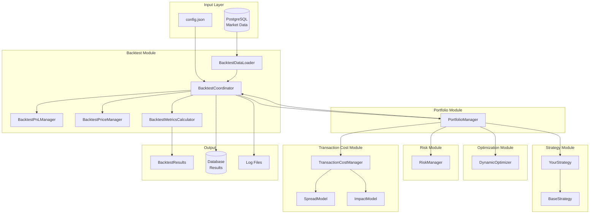

# Backtest Module

## Overview

The backtest module (`src/backtest/`) provides realistic historical backtesting capabilities with:
- **Transaction cost modeling** with spread and market impact
- **Slippage simulation** based on volume and volatility
- **Comprehensive metrics calculation** (Sharpe, Sortino, Calmar, etc.)
- **Multi-strategy portfolio support** via PortfolioManager
- **Database persistence** of results for analysis

> **Interconnections**: This module integrates with `strategy/`, `portfolio/`, `transaction_cost/`, `risk/`, `optimization/`, and `data/` modules.

---

## Architecture & Module Interconnections

```
backtest/
├── backtest_coordinator.cpp           # Main orchestrator
├── backtest_data_loader.cpp           # Historical data loading (uses data/)
├── backtest_execution_manager.cpp     # Execution simulation
├── backtest_metrics_calculator.cpp    # Performance metrics
├── backtest_pnl_manager.cpp           # PnL calculations
├── backtest_portfolio_constraints.cpp # Portfolio constraints
├── backtest_price_manager.cpp         # Price handling
├── slippage_model.cpp                 # Slippage simulation
└── transaction_cost_analysis.cpp      # Cost analysis
```

### Complete System Data Flow



---

## Running Backtests

```bash
# Build
cd build && cmake .. && cmake --build . --config Release && cd ..

# Run portfolio backtest
./build/bin/Release/bt_portfolio

# Run conservative variant
./build/bin/Release/bt_portfolio_conservative
```

---

## Complete End-to-End Walkthrough

### 1. Initialization Phase

```cpp
// bt_portfolio.cpp loads config and initializes all components

// 1. Load configuration
std::ifstream config_file("config.json");
nlohmann::json config;
config_file >> config;

// 2. Connect to database (uses data/postgres_database.cpp)
auto db = std::make_shared<PostgresDatabase>(connection_string);
db->connect();

// 3. Initialize instrument registry (uses instruments/)
auto& registry = InstrumentRegistry::instance();
registry.initialize(db.get());
registry.load_instruments();  // Loads contract specs from DB

// 4. Create transaction cost manager (uses transaction_cost/)
transaction_cost::TransactionCostManager::Config tc_config;
tc_config.explicit_fee_per_contract = 1.75;
auto cost_manager = std::make_unique<TransactionCostManager>(tc_config);

// 5. Create strategies (uses strategy/)
auto trend_strategy = std::make_shared<TrendFollowingStrategy>(...);

// 6. Create portfolio manager (uses portfolio/)
PortfolioConfig pm_config;
pm_config.total_capital = 500000.0;
auto portfolio = std::make_shared<PortfolioManager>(pm_config, db, &registry);
portfolio->add_strategy(trend_strategy, 0.7, true, true);

// 7. Create backtest coordinator
BacktestCoordinatorConfig bt_config;
bt_config.initial_capital = 500000.0;
BacktestCoordinator coordinator(db, &registry, bt_config, cost_manager);
```

### 2. Data Loading Phase

```cpp
// BacktestDataLoader queries PostgresDatabase for historical bars

auto bars = db->get_market_data(
    symbols,                    // ["ES", "NQ", "CL", "GC"]
    start_date,                 // 2024-01-01
    end_date,                   // 2024-12-31
    AssetClass::FUTURES,
    DataFrequency::DAILY,
    "continuous"                // Use continuous contracts
);

// Data is returned as Apache Arrow table, converted to vector<Bar>
std::vector<Bar> bar_history = convert_table_to_bars(bars.value());
```

### 3. Warmup Period Calculation

Strategies need historical data to calculate indicators. The warmup period is calculated as:

```cpp
int calculate_warmup_days(const PortfolioManager& portfolio) {
    int max_lookback = 0;
    
    for (const auto& strategy : portfolio.get_strategies()) {
        // Each strategy has different lookback requirements
        // TrendFollowingStrategy: max EMA window (256) + vol lookback (252)
        int strategy_lookback = strategy->get_required_warmup();
        max_lookback = std::max(max_lookback, strategy_lookback);
    }
    
    return max_lookback + 10;  // Buffer for safety
}
```

**Example**: For TrendFollowingStrategy with:
- EMA windows: [[2,8], [4,16], [8,32], [16,64], [32,128], [64,256]]
- Vol lookback long: 252 days

Warmup = max(256, 252) + 10 = **266 days**

---

### 4. Daily Processing Loop

For each trading day after warmup:

```cpp
for (size_t day = warmup_days; day < bar_history.size(); ++day) {
    Timestamp current_date = bar_history[day].timestamp;
    
    // Get bars for this day
    std::vector<Bar> day_bars;
    for (const auto& bar : bar_history) {
        if (bar.timestamp == current_date) {
            day_bars.push_back(bar);
        }
    }
    
    // ===== STEP 4A: Strategy Processing =====
    // PortfolioManager dispatches to each strategy
    portfolio->on_data(day_bars);
    
    // Inside on_data:
    // 1. Each strategy updates indicators
    // 2. Each strategy generates signals (forecasts)
    // 3. Each strategy calculates target positions
    
    // ===== STEP 4B: Position Aggregation =====
    auto aggregated_positions = portfolio->get_aggregated_positions();
    // Multiple strategies' positions are weighted and summed
    
    // ===== STEP 4C: Optimization =====
    // DynamicOptimizer minimizes tracking error with cost penalty
    auto optimized = optimizer->optimize(
        current_positions,
        aggregated_positions,
        costs,              // From TransactionCostManager
        weights_per_contract,
        covariance_matrix
    );
    
    // ===== STEP 4D: Risk Constraints =====
    // RiskManager applies VaR limits, leverage limits
    auto risk_result = risk_manager->process_positions(
        optimized_positions,
        market_data,
        current_prices
    );
    
    // Scale positions by risk multiplier
    for (auto& pos : optimized_positions) {
        pos *= risk_result.combined_multiplier;
    }
    
    // ===== STEP 4E: Execution Generation =====
    auto executions = generate_executions(
        previous_positions,
        optimized_positions,
        current_prices
    );
    
    // ===== STEP 4F: Transaction Cost Calculation =====
    for (auto& exec : executions) {
        auto cost_result = cost_manager->calculate_costs(
            exec.symbol,
            exec.quantity,
            exec.price
        );
        exec.commissions_fees = cost_result.commissions_fees;
        exec.total_transaction_costs = cost_result.total_transaction_costs;
    }
    
    // ===== STEP 4G: PnL Calculation =====
    double daily_pnl = pnl_manager->calculate_daily_pnl(
        previous_positions,
        current_positions,
        previous_prices,
        current_prices
    );
    
    // Subtract transaction costs
    double net_pnl = daily_pnl - sum(exec.total_transaction_costs);
    equity_curve.push_back({current_date, equity + net_pnl});
    equity = equity + net_pnl;
    
    // ===== STEP 4H: Store Results =====
    db->store_positions(current_positions, ...);
    db->store_executions(executions, ...);
}
```

---

## PnL Calculation Details

### Position PnL (Mark-to-Market)

```cpp
double calculate_position_pnl(
    const Position& position,
    double current_price,
    double prev_price,
    double contract_multiplier) 
{
    // PnL = quantity × (current_price - prev_price) × multiplier
    return position.quantity * (current_price - prev_price) * contract_multiplier;
}
```

**Worked Example**:
- Symbol: ES (E-mini S&P 500)
- Position: 10 contracts long
- Previous close: 4,950.00
- Current close: 5,000.00
- Contract multiplier: $50 per point

```
PnL = 10 × (5000.00 - 4950.00) × 50
    = 10 × 50.00 × 50
    = $25,000
```

### Transaction Cost Deduction (Approach B)

Transaction costs are NOT embedded in execution prices. They are calculated separately and deducted:

```cpp
double daily_equity = prev_equity 
    + gross_position_pnl           // From price changes
    - daily_transaction_costs;     // Sum of all execution costs
```

**Worked Example**:
- Previous equity: $500,000
- Gross position PnL: $25,000
- Transaction costs (5 trades): $457.50

```
Daily equity = $500,000 + $25,000 - $457.50 = $524,542.50
```

---

## Transaction Cost Integration

The backtest uses `TransactionCostManager` from the transaction_cost module:

```cpp
// For each execution
auto cost = cost_manager->calculate_costs(symbol, quantity, price);

// Result contains:
// - commissions_fees:        Explicit costs ($1.75 per contract)
// - spread_price_impact:     Half-spread in price units
// - market_impact_price_impact: Square-root impact in price units
// - total_transaction_costs: All costs in dollars
```

**Cost Breakdown Example** (ES, 10 contracts at $5,000):
| Component | Calculation | Amount |
|-----------|-------------|--------|
| Commissions | 10 × $1.75 | $17.50 |
| Spread | 0.5 × 1 × 0.25 × 10 × 50 | $62.50 |
| Market Impact | √(10/500000) × 10 × 5000 × 50 / 10000 | $11.18 |
| **Total** | | **$91.18** |

---

## Metrics Calculation (with Formulas)

The `BacktestMetricsCalculator` computes:

### Sharpe Ratio

```
Sharpe = (μ_daily - rf_daily) / σ_daily × √252

Where:
- μ_daily = mean of daily returns
- rf_daily = risk-free rate / 252 (typically 0)
- σ_daily = standard deviation of daily returns
```

**Worked Example**:
- Mean daily return: 0.0005 (0.05%)
- Daily std dev: 0.01 (1%)
- Risk-free rate: 0

```
Sharpe = (0.0005 - 0) / 0.01 × √252 = 0.05 × 15.87 = 0.79
```

### Sortino Ratio

```
Sortino = (μ_daily - rf_daily) / σ_downside × √252

Where:
- σ_downside = std dev of NEGATIVE daily returns only
```

### Max Drawdown

```
MaxDD = max(peak - trough) / peak

Where:
- peak = running maximum of equity curve
- trough = subsequent minimum before new peak
```

**Worked Example**:
- Peak equity: $550,000
- Subsequent low: $495,000

```
MaxDD = ($550,000 - $495,000) / $550,000 = 10%
```

### Calmar Ratio

```
Calmar = Annualized Return / Max Drawdown
```

### Win Rate

```
WinRate = (Days with positive return) / (Total trading days)
```

---

## Slippage Models

### Volume Slippage Model

```cpp
slippage = price_impact_coefficient × quantity × price / volume × volatility_multiplier

// Example: 
// price_impact = 1e-6
// quantity = 10, price = 5000, volume = 500000, vol_mult = 1.5
// slippage = 1e-6 × 10 × 5000 / 500000 × 1.5 = 0.00015 (1.5 bps)
```

### Fixed Slippage

```cpp
slippage_bps = 5;  // 5 basis points
slippage_per_contract = price × (slippage_bps / 10000.0);
```

---

## Database Schema

Results are persisted to PostgreSQL:

```sql
-- Backtest run metadata
CREATE TABLE backtest.runs (
    run_id VARCHAR(100) PRIMARY KEY,
    portfolio_id VARCHAR(100),
    start_date TIMESTAMPTZ,
    end_date TIMESTAMPTZ,
    initial_capital DOUBLE PRECISION,
    final_capital DOUBLE PRECISION,
    total_return DOUBLE PRECISION,
    annualized_return DOUBLE PRECISION,
    sharpe_ratio DOUBLE PRECISION,
    sortino_ratio DOUBLE PRECISION,
    max_drawdown DOUBLE PRECISION,
    calmar_ratio DOUBLE PRECISION,
    total_trades INTEGER,
    total_transaction_costs DOUBLE PRECISION,
    created_at TIMESTAMPTZ DEFAULT CURRENT_TIMESTAMP
);

-- Daily equity curve
CREATE TABLE backtest.equity_curve (
    id SERIAL PRIMARY KEY,
    run_id VARCHAR(100) REFERENCES backtest.runs(run_id),
    date DATE NOT NULL,
    equity DOUBLE PRECISION,
    daily_pnl DOUBLE PRECISION,
    daily_return DOUBLE PRECISION
);

-- Daily positions
CREATE TABLE backtest.positions (
    id SERIAL PRIMARY KEY,
    run_id VARCHAR(100),
    date DATE NOT NULL,
    symbol VARCHAR(10),
    strategy_id VARCHAR(100),
    quantity DOUBLE PRECISION,
    notional_value DOUBLE PRECISION
);

-- Trade executions
CREATE TABLE backtest.executions (
    id SERIAL PRIMARY KEY,
    run_id VARCHAR(100),
    timestamp TIMESTAMPTZ,
    symbol VARCHAR(10),
    side VARCHAR(4),
    quantity DOUBLE PRECISION,
    price DOUBLE PRECISION,
    commissions_fees DOUBLE PRECISION,
    spread_cost DOUBLE PRECISION,
    market_impact DOUBLE PRECISION,
    total_transaction_costs DOUBLE PRECISION
);
```

---

## Configuration Reference

### BacktestCoordinatorConfig

```cpp
struct BacktestCoordinatorConfig {
    double initial_capital = 500000.0;
    std::string schema = "backtest";       // DB schema for results
    
    // Persistence flags
    bool save_daily_positions = true;
    bool save_executions = true;
    bool save_equity_curve = true;
    bool save_to_database = true;
    
    // Logging
    LogLevel log_level = LogLevel::INFO;
};
```


---

## Testing

```bash
cd build
ctest -R backtest --output-on-failure
```

Test coverage includes:
- Single strategy backtest
- Multi-strategy portfolio backtest
- Transaction cost calculations
- Metrics accuracy
- Edge cases (no data, single day, etc.)

---

## Troubleshooting

### Common Issues

| Issue | Cause | Solution |
|-------|-------|----------|
| "No market data" | Date range has no data | Check database for available dates |
| NaN in Sharpe | Zero variance | Ensure enough trading days |
| Zero positions | Warmup not complete | Extend backtest date range |
| High transaction costs | Too frequent trading | Enable position buffering |

### Debug Logging

```cpp
// Enable verbose logging
log_config.min_level = LogLevel::DEBUG;  // Or TRACE for max detail
```

---

## References

- [Strategy Development Guide](../strategy/README.md) - How to create strategies
- [Transaction Cost Module](../transaction_cost/README.md) - Cost calculation details
- [Portfolio Module](../portfolio/README.md) - Multi-strategy coordination
- [Risk Module](../optimization/README.md) - Risk constraints
- [Data Module](../data/README.md) - Database operations

