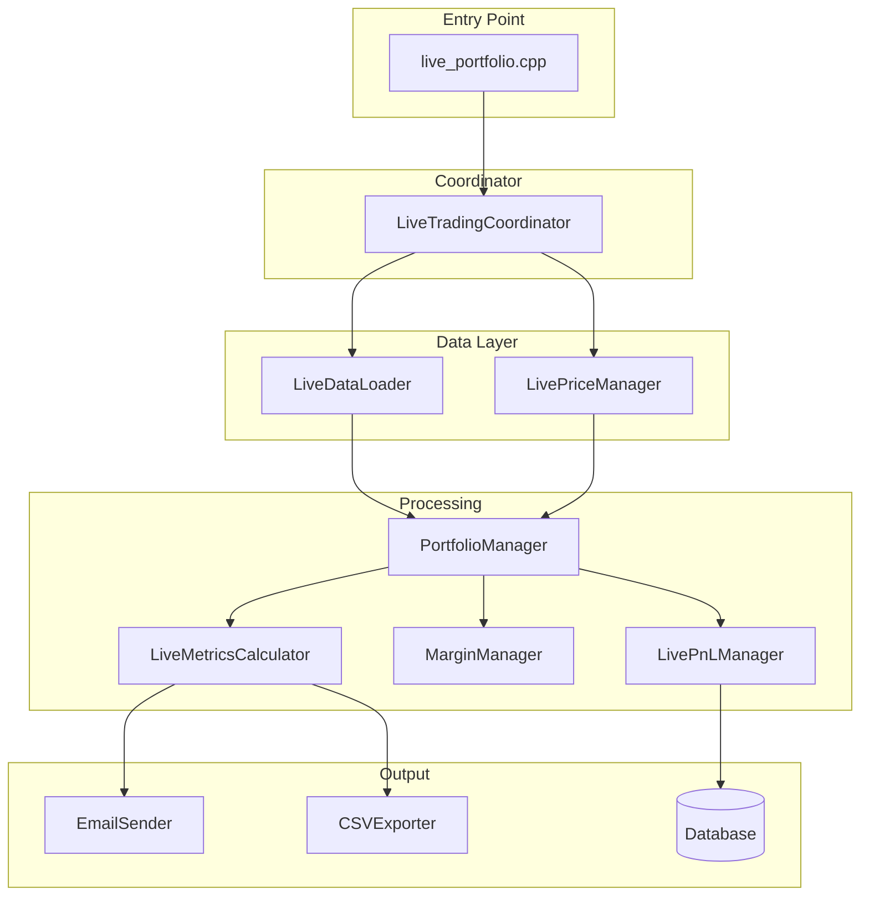

# Live Trading Module

## Overview

The live trading module (`src/live/`) handles real-time portfolio management, position persistence, email reporting, and CSV exports. It coordinates daily trading operations for production use.

---

## Architecture

```
live/
├── live_trading_coordinator.cpp   # Main coordinator
├── live_data_loader.cpp           # Load positions and market data
├── live_pnl_manager.cpp           # Real-time PnL tracking
├── live_price_manager.cpp         # Price management
├── live_metrics_calculator.cpp    # Performance metrics
├── execution_manager.cpp          # Trade execution
├── margin_manager.cpp             # Margin monitoring
└── csv_exporter.cpp               # Export to CSV files
```



---

## Running Live Trading

### Command Line

```bash
# Basic run (today's date)
./build/bin/Release/live_portfolio

# Specific date (YYYY-MM-DD format)
./build/bin/Release/live_portfolio 2025-01-15

# With email report
./build/bin/Release/live_portfolio 2025-01-15 --send-email

# Conservative portfolio
./build/bin/Release/live_portfolio_conservative 2025-01-15 --send-email
```

### Arguments

| Argument | Format | Description |
|----------|--------|-------------|
| Date | YYYY-MM-DD | Trading date to simulate/run |
| --send-email | Flag | Enable email report sending |

---

## Components

### 1. LiveTradingCoordinator

**File**: `src/live/live_trading_coordinator.cpp`

The main orchestrator for live trading operations.

#### Key Responsibilities

- Load previous day positions from database
- Process new market data
- Coordinate strategy execution
- Save updated positions
- Generate reports (email, CSV)

#### Workflow

```cpp
Result<void> LiveTradingCoordinator::run(const Timestamp& date, bool send_email) {
    // 1. Load previous positions
    auto positions = load_positions(prev_date);
    
    // 2. Load today's market data
    auto bars = load_market_data(date);
    
    // 3. Process through portfolio
    portfolio_->on_data(bars);
    
    // 4. Apply risk constraints
    risk_manager_->process_positions(positions);
    
    // 5. Save new positions
    save_positions(date);
    
    // 6. Generate reports
    if (send_email) {
        email_sender_->send_report(metrics);
    }
    
    csv_exporter_->export_positions(positions);
    
    return Result<void>();
}
```

---

### 2. LiveDataLoader

**File**: `src/live/live_data_loader.cpp`

Handles loading positions and market data from the database.

#### Key Methods

```cpp
// Load positions from a specific date
Result<std::unordered_map<std::string, Position>> load_positions_by_date(
    const Timestamp& date,
    const std::string& portfolio_id);

// Load market data for symbols
Result<std::vector<Bar>> load_market_data(
    const std::vector<std::string>& symbols,
    const Timestamp& start_date,
    const Timestamp& end_date,
    AssetClass asset_class,
    DataFrequency freq);

// Get latest prices for position valuation
Result<std::unordered_map<std::string, double>> get_latest_prices(
    const std::vector<std::string>& symbols);
```

---

### 3. LivePnLManager

**File**: `src/live/live_pnl_manager.cpp`

Tracks real-time P&L calculations.

#### Key Methods

```cpp
// Calculate daily P&L
Result<double> calculate_daily_pnl(
    const std::unordered_map<std::string, Position>& positions,
    const std::unordered_map<std::string, double>& current_prices,
    const std::unordered_map<std::string, double>& prev_prices);

// Get portfolio value
double get_portfolio_value(
    const std::unordered_map<std::string, Position>& positions,
    const std::unordered_map<std::string, double>& prices);
```

#### P&L Calculation

```cpp
// For each position:
// notional_value = quantity × price × contract_multiplier
// daily_pnl = position_quantity × (current_price - prev_price) × multiplier
```

---

### 4. LiveMetricsCalculator

**File**: `src/live/live_metrics_calculator.cpp`

Calculates performance metrics for reporting.

#### Metrics Calculated

| Metric | Description |
|--------|-------------|
| **Total Return** | Cumulative portfolio return |
| **Daily Return** | Single day return |
| **Sharpe Ratio** | Risk-adjusted return |
| **Sortino Ratio** | Downside risk-adjusted return |
| **Max Drawdown** | Largest peak-to-trough decline |
| **Volatility** | Annualized standard deviation |
| **Win Rate** | Percentage of winning days |

---

### 5. MarginManager

**File**: `src/live/margin_manager.cpp`

Monitors margin requirements and utilization.

#### Key Calculations

```cpp
// Calculate total margin required
double calculate_total_margin(
    const std::unordered_map<std::string, Position>& positions);

// Get margin utilization ratio
double get_margin_utilization(
    double total_margin,
    double available_capital);

// Check margin constraints
bool check_margin_constraints(
    const Position& new_position,
    double capital);
```

---

### 6. CSVExporter

**File**: `src/live/csv_exporter.cpp`

Exports positions and trades to CSV files.

#### Key Methods

```cpp
// Export positions to CSV
Result<void> export_positions(
    const std::vector<Position>& positions,
    const std::string& filepath);

// Export executions to CSV
Result<void> export_executions(
    const std::vector<ExecutionReport>& executions,
    const std::string& filepath);

// Export daily summary
Result<void> export_daily_summary(
    const DailySummary& summary,
    const std::string& filepath);
```

#### Output Format

Positions CSV:
```csv
date,symbol,quantity,price,notional_value,pnl,weight
2024-01-15,ES,10,5000.00,2500000.00,5000.00,0.25
2024-01-15,NQ,5,17500.00,1750000.00,2500.00,0.175
```

---

## Email Reports

The email system (`src/core/email_sender.cpp`) generates comprehensive HTML reports.

### Report Contents

1. **Summary Section**
   - Portfolio value
   - Daily P&L
   - YTD return
   
2. **Performance Metrics**
   - Sharpe/Sortino ratios
   - Max drawdown
   - Win rate

3. **Positions Table**
   - All current positions
   - Individual P&L
   - Weight in portfolio

4. **Charts** (embedded)
   - Equity curve
   - P&L attribution
   - Position distribution

### Chart Generation

```cpp
// Charts are generated using chart_generator.cpp
ChartGenerator generator;
auto equity_chart = generator.generate_equity_curve(equity_data);
auto pnl_chart = generator.generate_pnl_chart(pnl_data);
```

---

## Configuration

### Email Configuration

```json
{
  "email": {
    "smtp_host": "smtp.gmail.com",
    "smtp_port": 587,
    "username": "your-email@gmail.com",
    "password": "app-password",
    "from_email": "your-email@gmail.com",
    "to_emails": ["recipient1@example.com"],
    "use_tls": true
  }
}
```

### Portfolio Configuration

```json
{
  "portfolio_id": "PORTFOLIO_A",
  "portfolio": {
    "strategies": {
      "TREND_FOLLOWING": {
        "enabled_live": true,
        "default_allocation": 0.7
      },
      "MEAN_REVERSION": {
        "enabled_live": true,
        "default_allocation": 0.3
      }
    }
  }
}
```

---

## Database Tables

### Live Positions Table

```sql
CREATE TABLE live.positions (
    id SERIAL PRIMARY KEY,
    timestamp TIMESTAMPTZ,
    symbol VARCHAR(10),
    quantity DOUBLE PRECISION,
    average_price DOUBLE PRECISION,
    strategy_id VARCHAR(50),
    strategy_name VARCHAR(100),
    portfolio_id VARCHAR(50),
    run_id VARCHAR(100)
);
```

### Live Executions Table

```sql
CREATE TABLE live.executions (
    id SERIAL PRIMARY KEY,
    timestamp TIMESTAMPTZ,
    symbol VARCHAR(10),
    side VARCHAR(4),
    quantity DOUBLE PRECISION,
    price DOUBLE PRECISION,
    commissions_fees DOUBLE PRECISION,
    total_transaction_costs DOUBLE PRECISION,
    strategy_id VARCHAR(50),
    portfolio_id VARCHAR(50),
    run_id VARCHAR(100)
);
```

---

## Daily Operations Workflow

### Typical Cron Job Setup

```bash
# Run at 5 PM ET (market close processing)
0 17 * * 1-5 /path/to/live_portfolio $(date +\%m-\%d) --send-email
```

### Manual Processing

```bash
# 1. Check previous day's positions
psql -c "SELECT * FROM live.positions WHERE DATE(timestamp) = '2024-01-14'"

# 2. Run live processing
./build/bin/Release/live_portfolio 01-15 --send-email

# 3. Verify new positions
psql -c "SELECT * FROM live.positions WHERE DATE(timestamp) = '2024-01-15'"

# 4. Check logs
tail -100 logs/live_*.log
```

---

## Error Handling

The module uses `Result<T>` for all operations:

```cpp
auto result = coordinator.run(date, send_email);
if (result.is_error()) {
    ERROR("Live trading failed: " + std::string(result.error()->what()));
    return 1;
}
```

### Common Errors

| Error | Cause | Resolution |
|-------|-------|------------|
| `DATABASE_ERROR` | DB connection failed | Check credentials |
| `DATA_NOT_FOUND` | No positions for date | Check date format |
| `INVALID_DATA` | Corrupt market data | Verify data source |
| `EMAIL_ERROR` | SMTP failure | Check email config |

---

## Testing

```bash
# Run live module tests
cd build
ctest -R live --output-on-failure
```

---

## References

- [Strategy Development Guide](../strategy/README.md) - Creating strategies
- [Portfolio Module](../portfolio/README.md) - Multi-strategy coordination
- [Backtest Module](../backtest/README.md) - Historical testing
- [Transaction Cost Module](../transaction_cost/README.md) - Cost calculations
- [Data Module](../data/README.md) - Database operations
