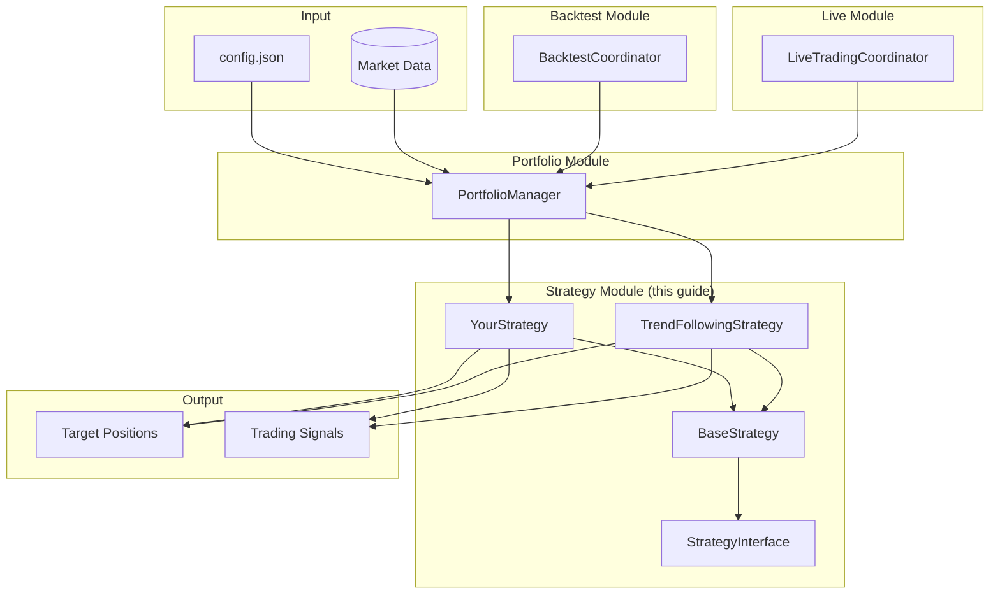
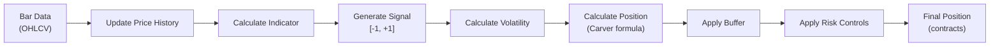
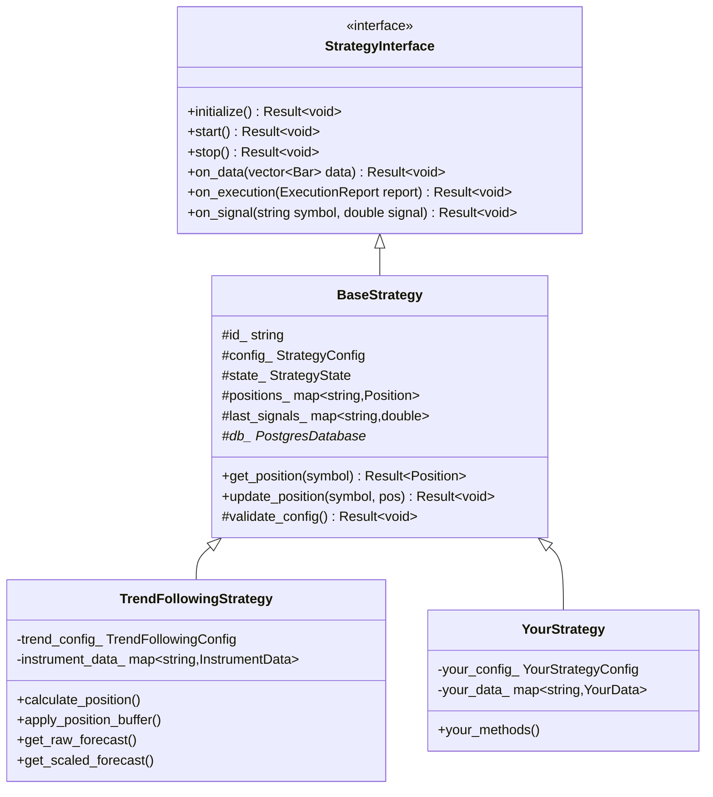

# Strategy Development Guide

## Overview

This guide provides comprehensive documentation for creating trading strategies in trade-ngin. It covers:
- **Strategy interface and base class** functionality
- **Implementation patterns** with complete working examples
- **Position sizing formulas** (Carver-style risk-based sizing)
- **Interconnections** with portfolio, backtest, and live trading modules

> **Interconnections**: Strategies integrate with `portfolio/` (aggregation), `backtest/` (historical testing), `live/` (production), `transaction_cost/` (cost-aware optimization), and `risk/` (position constraints).

---

## How Strategy Fits in the System



### Strategy Data Flow (Per Bar)



---

## Architecture

```
strategy/
├── base_strategy.cpp           # Common strategy functionality
├── regime_detector.cpp         # Market regime classification
├── trend_following.cpp         # Main trend strategy
├── trend_following_fast.cpp    # Fast variant
└── trend_following_slow.cpp    # Slow variant

include/trade_ngin/strategy/
├── strategy_interface.hpp      # Abstract interface
├── base_strategy.hpp           # Base implementation
├── types.hpp                   # Strategy types and configs
├── trend_following.hpp
├── trend_following_fast.hpp
├── trend_following_slow.hpp
└── regime_detector.hpp
```

---

## Core Concepts

### Strategy Hierarchy



---

## Step 1: Define Your Configuration

Every strategy needs a configuration structure for its parameters.

### Configuration Structure

```cpp
// include/trade_ngin/strategy/your_strategy.hpp

struct YourStrategyConfig {
    // Position sizing parameters
    double weight = 0.03;           // Weight per symbol (3%)
    double risk_target = 0.20;      // Annualized risk target (20%)
    double idm = 2.5;               // Instrument Diversification Multiplier
    double fx_rate = 1.0;           // FX conversion (for non-USD)
    
    // Your strategy-specific parameters
    int lookback_period = 20;       // Lookback window
    double signal_threshold = 0.5;  // Signal generation threshold
    bool use_volatility_scaling = true;
    
    // Volatility parameters
    int vol_lookback_short = 32;    // Short-term vol window
    int vol_lookback_long = 252;    // Long-term vol window
    
    // Position buffering (reduces trading)
    bool use_position_buffering = true;
    double buffer_fraction = 0.10;  // 10% buffer
};
```

### StrategyConfig (Base Class)

The base class uses `StrategyConfig` from `types.hpp`:

```cpp
struct StrategyConfig : public ConfigBase {
    double capital_allocation = 0.0;    // Capital for this strategy
    double max_leverage = 0.0;          // Maximum leverage allowed
    
    std::unordered_map<std::string, double> position_limits;  // Per-symbol limits
    std::unordered_map<std::string, double> trading_params;   // Trading parameters
    
    std::vector<AssetClass> asset_classes;      // What you trade
    std::vector<DataFrequency> frequencies;     // Data frequency
    
    // Persistence flags
    bool save_executions = false;
    bool save_signals = false;
    bool save_positions = false;
};
```

---

## Step 2: Define Your Data Structures

Store per-instrument data for calculations.

```cpp
// include/trade_ngin/strategy/your_strategy.hpp

struct YourInstrumentData {
    // Static properties
    double contract_size = 1.0;      // From instrument registry
    double weight = 1.0;             // Symbol weight
    
    // Price data
    std::vector<double> price_history;
    std::vector<double> returns;
    
    // Your indicators
    std::vector<double> indicator_values;
    double current_signal = 0.0;
    
    // Volatility estimates
    double short_vol = 0.01;
    double long_vol = 0.01;
    double combined_vol = 0.01;
    
    // Position tracking
    double raw_position = 0.0;       // Before risk adjustments
    double buffered_position = 0.0;  // After buffering
    double final_position = 0.0;     // After all adjustments
    
    // Timestamps
    Timestamp last_update;
};
```

---

## Step 3: Create Your Header File

```cpp
// include/trade_ngin/strategy/your_strategy.hpp
#pragma once

#include <memory>
#include <string>
#include <unordered_map>
#include <vector>

#include "trade_ngin/core/error.hpp"
#include "trade_ngin/core/types.hpp"
#include "trade_ngin/instruments/instrument_registry.hpp"
#include "trade_ngin/strategy/base_strategy.hpp"

namespace trade_ngin {

// Configuration (from above)
struct YourStrategyConfig { ... };

// Per-instrument data (from above)
struct YourInstrumentData { ... };

/**
 * @brief Your Custom Strategy
 * 
 * Detailed description of what your strategy does,
 * its key principles, and expected behavior.
 */
class YourStrategy : public BaseStrategy {
public:
    /**
     * @brief Construct a new strategy instance
     * 
     * @param id Unique strategy identifier
     * @param config Base strategy configuration
     * @param your_config Your strategy-specific configuration
     * @param db Database connection for data access
     * @param registry Instrument registry for contract metadata
     */
    YourStrategy(
        std::string id,
        StrategyConfig config,
        YourStrategyConfig your_config,
        std::shared_ptr<PostgresDatabase> db,
        std::shared_ptr<InstrumentRegistry> registry = nullptr
    );

    // ===== Required Overrides =====
    
    /**
     * @brief Initialize the strategy
     * Called once before trading begins. Set up data structures.
     */
    Result<void> initialize() override;
    
    /**
     * @brief Process new market data
     * Called for each bar of data. Main trading logic here.
     */
    Result<void> on_data(const std::vector<Bar>& data) override;

    // ===== Public Accessors =====
    
    double get_signal(const std::string& symbol) const;
    double get_position(const std::string& symbol) const;
    double get_volatility(const std::string& symbol) const;
    const YourInstrumentData* get_instrument_data(const std::string& symbol) const;

protected:
    /**
     * @brief Validate configuration
     * Called during initialization to check parameters.
     */
    Result<void> validate_config() const override;

private:
    // ===== Components =====
    YourStrategyConfig your_config_;
    std::shared_ptr<InstrumentRegistry> registry_;
    
    // ===== Data Storage =====
    std::unordered_map<std::string, YourInstrumentData> instrument_data_;
    
    // ===== Calculation Methods =====
    
    /**
     * @brief Calculate your indicator
     * @param prices Historical prices
     * @return Indicator values
     */
    std::vector<double> calculate_indicator(
        const std::vector<double>& prices) const;
    
    /**
     * @brief Generate trading signal from indicator
     * @param indicator Indicator values
     * @return Signal in range [-1, +1] or similar
     */
    double calculate_signal(
        const std::vector<double>& indicator) const;
    
    /**
     * @brief Calculate volatility estimate
     * @param returns Return series
     * @param short_window Short-term window
     * @param long_window Long-term window
     * @return Combined volatility estimate
     */
    double calculate_volatility(
        const std::vector<double>& returns,
        int short_window,
        int long_window) const;
    
    /**
     * @brief Calculate position size
     * @param symbol Instrument symbol
     * @param signal Trading signal
     * @param price Current price
     * @param volatility Volatility estimate
     * @return Position in contracts
     */
    double calculate_position(
        const std::string& symbol,
        double signal,
        double price,
        double volatility) const;
    
    /**
     * @brief Apply position buffering
     * @param symbol Instrument symbol
     * @param target_position New target position
     * @return Buffered position (may be unchanged)
     */
    double apply_position_buffer(
        const std::string& symbol,
        double target_position) const;
    
    /**
     * @brief Apply risk controls
     * @param symbol Instrument symbol
     * @param position Raw position
     * @return Risk-adjusted position
     */
    double apply_risk_controls(
        const std::string& symbol,
        double position) const;
};

} // namespace trade_ngin
```

---

## Step 4: Implement Your Strategy

```cpp
// src/strategy/your_strategy.cpp

#include "trade_ngin/strategy/your_strategy.hpp"

#include <algorithm>
#include <cmath>
#include <iostream>
#include <numeric>

#include "trade_ngin/core/logger.hpp"

namespace trade_ngin {

// ============================================================================
// Constructor
// ============================================================================

YourStrategy::YourStrategy(
    std::string id,
    StrategyConfig config,
    YourStrategyConfig your_config,
    std::shared_ptr<PostgresDatabase> db,
    std::shared_ptr<InstrumentRegistry> registry)
    : BaseStrategy(std::move(id), std::move(config), std::move(db)),
      your_config_(std::move(your_config)),
      registry_(registry)
{
    // Register logging component
    Logger::register_component("YourStrategy");
    
    // Set metadata
    metadata_.name = "Your Strategy Name";
    metadata_.description = "Description of your strategy";
}

// ============================================================================
// Configuration Validation
// ============================================================================

Result<void> YourStrategy::validate_config() const {
    // First validate base class configuration
    auto base_result = BaseStrategy::validate_config();
    if (base_result.is_error()) {
        return base_result;
    }
    
    // Validate your specific parameters
    if (your_config_.risk_target <= 0.0 || your_config_.risk_target > 1.0) {
        return make_error<void>(
            ErrorCode::INVALID_ARGUMENT,
            "Risk target must be between 0 and 1",
            "YourStrategy"
        );
    }
    
    if (your_config_.lookback_period <= 0) {
        return make_error<void>(
            ErrorCode::INVALID_ARGUMENT,
            "Lookback period must be positive",
            "YourStrategy"
        );
    }
    
    if (your_config_.weight <= 0.0 || your_config_.weight > 1.0) {
        return make_error<void>(
            ErrorCode::INVALID_ARGUMENT,
            "Weight must be between 0 and 1",
            "YourStrategy"
        );
    }
    
    if (your_config_.idm <= 0.0) {
        return make_error<void>(
            ErrorCode::INVALID_ARGUMENT,
            "IDM must be positive",
            "YourStrategy"
        );
    }
    
    INFO("YourStrategy configuration validated successfully");
    return Result<void>();
}

// ============================================================================
// Initialization
// ============================================================================

Result<void> YourStrategy::initialize() {
    // Initialize base class first
    auto base_result = BaseStrategy::initialize();
    if (base_result.is_error()) {
        ERROR("Base strategy initialization failed: " + 
              std::string(base_result.error()->what()));
        return base_result;
    }
    
    try {
        // Clear any existing data
        instrument_data_.clear();
        
        // Initialize data structures for each symbol
        for (const auto& [symbol, _] : config_.trading_params) {
            auto& data = instrument_data_[symbol];
            
            // Get contract metadata from registry
            if (registry_) {
                auto instrument = registry_->get_instrument(symbol);
                if (instrument) {
                    data.contract_size = instrument->get_multiplier();
                }
            }
            
            // Set weight (from trading_params or default)
            data.weight = your_config_.weight;
            
            // Reserve memory for performance
            data.price_history.reserve(500);
            data.returns.reserve(500);
            data.indicator_values.reserve(500);
            
            // Initialize position in base class
            Position pos;
            pos.symbol = symbol;
            pos.quantity = 0.0;
            pos.average_price = 1.0;
            pos.last_update = std::chrono::system_clock::now();
            positions_[symbol] = pos;
            
            DEBUG("Initialized instrument data for " + symbol);
        }
        
        INFO("YourStrategy initialized with " + 
             std::to_string(instrument_data_.size()) + " symbols");
        
        return Result<void>();
        
    } catch (const std::exception& e) {
        ERROR("Exception in YourStrategy::initialize: " + std::string(e.what()));
        return make_error<void>(
            ErrorCode::STRATEGY_ERROR,
            std::string("Failed to initialize: ") + e.what(),
            "YourStrategy"
        );
    }
}

// ============================================================================
// Data Processing (Main Logic)
// ============================================================================

Result<void> YourStrategy::on_data(const std::vector<Bar>& data) {
    // Validate input
    if (data.empty()) {
        return Result<void>();  // Nothing to process
    }
    
    // Call base class
    auto base_result = BaseStrategy::on_data(data);
    if (base_result.is_error()) {
        return base_result;
    }
    
    try {
        // Group bars by symbol
        std::unordered_map<std::string, std::vector<Bar>> bars_by_symbol;
        for (const auto& bar : data) {
            if (bar.symbol.empty() || bar.close <= 0.0) {
                continue;  // Skip invalid bars
            }
            bars_by_symbol[bar.symbol].push_back(bar);
        }
        
        // Process each symbol
        for (const auto& [symbol, bars] : bars_by_symbol) {
            // Skip if not in our trading universe
            if (instrument_data_.find(symbol) == instrument_data_.end()) {
                continue;
            }
            
            auto& inst_data = instrument_data_[symbol];
            
            // Update price history
            for (const auto& bar : bars) {
                double price = static_cast<double>(bar.close);
                
                // Calculate return
                if (!inst_data.price_history.empty()) {
                    double prev_price = inst_data.price_history.back();
                    if (prev_price > 0) {
                        double ret = (price - prev_price) / prev_price;
                        inst_data.returns.push_back(ret);
                    }
                }
                
                inst_data.price_history.push_back(price);
            }
            
            // Need minimum data
            if (inst_data.price_history.size() < 
                static_cast<size_t>(your_config_.lookback_period)) {
                DEBUG("Warming up " + symbol + ": " + 
                      std::to_string(inst_data.price_history.size()) + "/" +
                      std::to_string(your_config_.lookback_period));
                continue;
            }
            
            // ===== Calculate Indicator =====
            auto indicator = calculate_indicator(inst_data.price_history);
            inst_data.indicator_values = indicator;
            
            // ===== Calculate Signal =====
            double signal = calculate_signal(indicator);
            inst_data.current_signal = signal;
            
            // ===== Calculate Volatility =====
            if (inst_data.returns.size() >= 
                static_cast<size_t>(your_config_.vol_lookback_short)) {
                double vol = calculate_volatility(
                    inst_data.returns,
                    your_config_.vol_lookback_short,
                    your_config_.vol_lookback_long
                );
                inst_data.combined_vol = vol;
            }
            
            // ===== Calculate Position =====
            double price = inst_data.price_history.back();
            double raw_pos = calculate_position(
                symbol, signal, price, inst_data.combined_vol
            );
            inst_data.raw_position = raw_pos;
            
            // ===== Apply Position Buffering =====
            double buffered_pos = raw_pos;
            if (your_config_.use_position_buffering) {
                buffered_pos = apply_position_buffer(symbol, raw_pos);
            }
            inst_data.buffered_position = buffered_pos;
            
            // ===== Apply Risk Controls =====
            double final_pos = apply_risk_controls(symbol, buffered_pos);
            inst_data.final_position = final_pos;
            
            // ===== Update Base Class Position =====
            Position pos;
            pos.symbol = symbol;
            pos.quantity = final_pos;
            pos.average_price = price;
            pos.last_update = bars.back().timestamp;
            
            auto update_result = update_position(symbol, pos);
            if (update_result.is_error()) {
                WARN("Failed to update position for " + symbol);
            }
            
            // ===== Save Signal =====
            auto signal_result = on_signal(symbol, signal);
            if (signal_result.is_error()) {
                WARN("Failed to save signal for " + symbol);
            }
            
            inst_data.last_update = bars.back().timestamp;
            
            TRACE("Processed " + symbol + ": signal=" + std::to_string(signal) +
                  " raw_pos=" + std::to_string(raw_pos) +
                  " final_pos=" + std::to_string(final_pos));
        }
        
        return Result<void>();
        
    } catch (const std::exception& e) {
        ERROR("Exception in on_data: " + std::string(e.what()));
        return make_error<void>(
            ErrorCode::STRATEGY_ERROR,
            std::string("Error processing data: ") + e.what(),
            "YourStrategy"
        );
    }
}

// ============================================================================
// Indicator Calculation
// ============================================================================

std::vector<double> YourStrategy::calculate_indicator(
    const std::vector<double>& prices) const 
{
    std::vector<double> indicator(prices.size(), 0.0);
    int lookback = your_config_.lookback_period;
    
    if (prices.size() < static_cast<size_t>(lookback)) {
        return indicator;
    }
    
    // Example: Simple Moving Average
    for (size_t i = lookback - 1; i < prices.size(); ++i) {
        double sum = 0.0;
        for (size_t j = 0; j < static_cast<size_t>(lookback); ++j) {
            sum += prices[i - j];
        }
        indicator[i] = sum / lookback;
    }
    
    // Or implement your custom indicator here:
    // - EMA crossover
    // - RSI
    // - Bollinger Bands
    // - Custom signals
    
    return indicator;
}

// ============================================================================
// Signal Generation
// ============================================================================

double YourStrategy::calculate_signal(
    const std::vector<double>& indicator) const 
{
    if (indicator.empty()) {
        return 0.0;
    }
    
    // Get recent indicator values
    double current = indicator.back();
    size_t lookback = std::min(indicator.size(), static_cast<size_t>(5));
    
    // Calculate average of recent values
    double sum = 0.0;
    for (size_t i = 0; i < lookback; ++i) {
        sum += indicator[indicator.size() - 1 - i];
    }
    double avg = sum / lookback;
    
    // Simple threshold-based signal
    double diff = current - avg;
    double threshold = your_config_.signal_threshold;
    
    if (diff > threshold) {
        return 1.0;   // Long signal
    } else if (diff < -threshold) {
        return -1.0;  // Short signal
    }
    
    return 0.0;  // No signal
}

// ============================================================================
// Volatility Calculation
// ============================================================================

double YourStrategy::calculate_volatility(
    const std::vector<double>& returns,
    int short_window,
    int long_window) const 
{
    // Need minimum data
    if (returns.size() < static_cast<size_t>(short_window)) {
        return 0.01;  // Default
    }
    
    auto calc_vol = [](const std::vector<double>& r, size_t start, size_t len) {
        if (len == 0) return 0.01;
        
        double sum = 0.0;
        double sum_sq = 0.0;
        
        for (size_t i = start; i < start + len && i < r.size(); ++i) {
            sum += r[i];
            sum_sq += r[i] * r[i];
        }
        
        double mean = sum / len;
        double var = (sum_sq / len) - (mean * mean);
        return std::sqrt(std::max(var, 1e-10));
    };
    
    // Calculate short-term volatility
    size_t short_start = returns.size() > static_cast<size_t>(short_window) 
                        ? returns.size() - short_window : 0;
    double short_vol = calc_vol(returns, short_start, short_window);
    
    // Calculate long-term volatility (if enough data)
    double long_vol = short_vol;
    if (returns.size() >= static_cast<size_t>(long_window)) {
        size_t long_start = returns.size() - long_window;
        long_vol = calc_vol(returns, long_start, long_window);
    }
    
    // Blend short and long volatility (30/70)
    double combined = 0.3 * short_vol + 0.7 * long_vol;
    
    // Annualize (assuming daily data)
    return combined * std::sqrt(252.0);
}

// ============================================================================
// Position Sizing
// ============================================================================

double YourStrategy::calculate_position(
    const std::string& symbol,
    double signal,
    double price,
    double volatility) const 
{
    // Get instrument data
    auto it = instrument_data_.find(symbol);
    if (it == instrument_data_.end()) {
        return 0.0;
    }
    
    const auto& inst_data = it->second;
    
    // No signal = no position
    if (std::abs(signal) < 1e-10) {
        return 0.0;
    }
    
    // Volatility floor
    double vol = std::max(volatility, 0.001);
    
    // Get parameters
    double capital = config_.capital_allocation;
    double weight = inst_data.weight;
    double contract_size = inst_data.contract_size;
    double idm = your_config_.idm;
    double risk_target = your_config_.risk_target;
    double fx_rate = your_config_.fx_rate;
    
    // Position sizing formula:
    // position = (signal × capital × weight × IDM × risk_target) / 
    //            (price × contract_size × fx_rate × volatility × 10)
    //
    // The 10 normalizes forecasts in range [-10, +10] or [-20, +20]
    
    double denominator = 10.0 * contract_size * price * fx_rate * vol;
    
    if (denominator < 1e-10) {
        return 0.0;  // Avoid division by zero
    }
    
    double position = (signal * capital * weight * idm * risk_target) / denominator;
    
    // Round to whole contracts
    position = std::round(position);
    
    // Apply position limits
    double limit = 1000.0;  // Default
    if (config_.position_limits.count(symbol) > 0) {
        limit = config_.position_limits.at(symbol);
    }
    
    return std::clamp(position, -limit, limit);
}

// ============================================================================
// Position Buffering
// ============================================================================

double YourStrategy::apply_position_buffer(
    const std::string& symbol,
    double target_position) const 
{
    // Get current position
    double current_position = 0.0;
    auto it = positions_.find(symbol);
    if (it != positions_.end()) {
        current_position = static_cast<double>(it->second.quantity);
    }
    
    // Calculate buffer width (10% of target or configurable)
    double buffer_fraction = your_config_.buffer_fraction;
    double buffer_width = buffer_fraction * std::abs(target_position);
    
    // Minimum buffer of 1 contract
    buffer_width = std::max(buffer_width, 1.0);
    
    // Define buffer zone
    double lower_bound = target_position - buffer_width;
    double upper_bound = target_position + buffer_width;
    
    // If current position is within buffer, don't trade
    if (current_position >= lower_bound && current_position <= upper_bound) {
        return current_position;  // No change
    }
    
    // Otherwise, move to nearest buffer edge
    if (current_position < lower_bound) {
        return std::round(lower_bound);
    } else {
        return std::round(upper_bound);
    }
}

// ============================================================================
// Risk Controls
// ============================================================================

double YourStrategy::apply_risk_controls(
    const std::string& symbol,
    double position) const 
{
    double final_pos = position;
    
    // Position limit check
    double limit = 1000.0;
    if (config_.position_limits.count(symbol) > 0) {
        limit = config_.position_limits.at(symbol);
    }
    final_pos = std::clamp(final_pos, -limit, limit);
    
    // Add additional risk controls as needed:
    // - Maximum daily change
    // - Correlation constraints
    // - Portfolio-level limits
    
    return std::round(final_pos);
}

// ============================================================================
// Public Accessors
// ============================================================================

double YourStrategy::get_signal(const std::string& symbol) const {
    auto it = instrument_data_.find(symbol);
    return (it != instrument_data_.end()) ? it->second.current_signal : 0.0;
}

double YourStrategy::get_position(const std::string& symbol) const {
    auto it = instrument_data_.find(symbol);
    return (it != instrument_data_.end()) ? it->second.final_position : 0.0;
}

double YourStrategy::get_volatility(const std::string& symbol) const {
    auto it = instrument_data_.find(symbol);
    return (it != instrument_data_.end()) ? it->second.combined_vol : 0.01;
}

const YourInstrumentData* YourStrategy::get_instrument_data(
    const std::string& symbol) const 
{
    auto it = instrument_data_.find(symbol);
    return (it != instrument_data_.end()) ? &it->second : nullptr;
}

} // namespace trade_ngin
```

---

## Step 5: Update Build Configuration

### Add to CMakeLists.txt

```cmake
# src/CMakeLists.txt

target_sources(trade_ngin_core
    PRIVATE
        # ... existing sources ...
        strategy/your_strategy.cpp
)
```

### Add Backtest Application

```cmake
# apps/backtest/CMakeLists.txt

add_executable(bt_your_strategy
    bt_your_strategy.cpp
)

target_link_libraries(bt_your_strategy
    trade_ngin_core
    trade_ngin_backtest
)
```

---

## Step 6: Create Backtest Application

```cpp
// apps/backtest/bt_your_strategy.cpp

#include <fstream>
#include <iostream>
#include <nlohmann/json.hpp>

#include "trade_ngin/backtest/backtest_coordinator.hpp"
#include "trade_ngin/core/logger.hpp"
#include "trade_ngin/data/postgres_database.hpp"
#include "trade_ngin/instruments/instrument_registry.hpp"
#include "trade_ngin/portfolio/portfolio_manager.hpp"
#include "trade_ngin/strategy/your_strategy.hpp"

using namespace trade_ngin;
using namespace trade_ngin::backtest;

int main() {
    // Load configuration
    std::ifstream config_file("config.json");
    nlohmann::json config;
    config_file >> config;
    
    // Initialize logger
    auto& logger = Logger::instance();
    LoggerConfig log_config;
    log_config.min_level = LogLevel::INFO;
    log_config.destination = LogDestination::BOTH;
    log_config.log_directory = "logs";
    log_config.filename_prefix = "bt_your_strategy";
    logger.initialize(log_config);
    
    INFO("Starting Your Strategy backtest");
    
    // Connect to database
    auto db = std::make_shared<PostgresDatabase>(/* connection string */);
    auto connect_result = db->connect();
    if (connect_result.is_error()) {
        std::cerr << "Database connection failed" << std::endl;
        return 1;
    }
    
    // Initialize instrument registry
    auto& registry = InstrumentRegistry::instance();
    registry.initialize(db.get());
    registry.load_instruments();
    
    // Create strategy configuration
    StrategyConfig strat_config;
    strat_config.capital_allocation = 500000.0;
    strat_config.trading_params = {
        {"ES", 1.0}, {"NQ", 1.0}, {"CL", 1.0}, {"GC", 1.0}
    };
    strat_config.save_positions = true;
    strat_config.save_executions = true;
    
    YourStrategyConfig your_config;
    your_config.lookback_period = 20;
    your_config.risk_target = 0.20;
    your_config.idm = 2.5;
    
    // Create strategy
    auto strategy = std::make_shared<YourStrategy>(
        "YOUR_STRATEGY_001",
        strat_config,
        your_config,
        db,
        &registry
    );
    
    // Initialize
    auto init_result = strategy->initialize();
    if (init_result.is_error()) {
        ERROR("Strategy initialization failed");
        return 1;
    }
    
    // Run backtest
    BacktestCoordinatorConfig bt_config;
    bt_config.initial_capital = 500000.0;
    bt_config.schema = "backtest_results";
    
    BacktestCoordinator coordinator(db, &registry, bt_config);
    coordinator.initialize();
    
    std::vector<std::string> symbols = {"ES", "NQ", "CL", "GC"};
    Timestamp start = parse_date("2024-01-01");
    Timestamp end = parse_date("2024-12-31");
    
    auto result = coordinator.run_single_strategy(
        strategy,
        symbols,
        start,
        end,
        AssetClass::FUTURES,
        DataFrequency::DAILY
    );
    
    if (result.is_error()) {
        ERROR("Backtest failed: " + std::string(result.error()->what()));
        return 1;
    }
    
    // Print results
    auto& results = result.value();
    std::cout << "\n=== Backtest Results ===" << std::endl;
    std::cout << "Total Return: " << results.total_return * 100 << "%" << std::endl;
    std::cout << "Sharpe Ratio: " << results.sharpe_ratio << std::endl;
    std::cout << "Max Drawdown: " << results.max_drawdown * 100 << "%" << std::endl;
    std::cout << "Total Trades: " << results.total_trades << std::endl;
    
    return 0;
}
```

---

## Step 7: Register in Portfolio

To use multiple strategies, register in `config.json`:

```json
{
  "portfolio": {
    "strategies": {
      "YOUR_STRATEGY": {
        "enabled_backtest": true,
        "enabled_live": true,
        "default_allocation": 0.5,
        "type": "YourStrategy",
        "config": {
          "lookback_period": 20,
          "risk_target": 0.20,
          "signal_threshold": 0.5
        }
      },
      "TREND_FOLLOWING": {
        "enabled_backtest": true,
        "enabled_live": true,
        "default_allocation": 0.5,
        "type": "TrendFollowingStrategy"
      }
    }
  }
}
```

---

## Key Formulas Reference

### Position Sizing (Carver Style)

```
position = (forecast × capital × weight × IDM × risk_target) / 
           (10 × contract_size × price × fx_rate × volatility)
```

| Variable | Description |
|----------|-------------|
| forecast | Signal strength, typically in [-20, +20] or [-1, +1] |
| capital | Allocated capital |
| weight | Symbol weight (e.g., 0.03 for 3%) |
| IDM | Instrument Diversification Multiplier (typically 2.0-2.5) |
| risk_target | Annual volatility target (e.g., 0.20 for 20%) |
| contract_size | Dollar value per contract (e.g., $50 per ES point) |
| price | Current price |
| fx_rate | FX conversion (1.0 for USD) |
| volatility | Annualized volatility estimate |

### Volatility Blending

```
combined_vol = 0.3 × short_term_vol + 0.7 × long_term_vol
annualized_vol = daily_vol × √252
```

### Position Buffer

```
buffer_width = buffer_fraction × |target_position|
lower = target - buffer_width
upper = target + buffer_width

if current ∈ [lower, upper]:
    keep current (no trade)
else:
    move to nearest edge
```

---

## Best Practices

1. **Validate Everything**: Use `validate_config()` for all parameter checks
2. **Handle Errors**: Return `Result<T>` and check all results
3. **Log Extensively**: Use DEBUG/TRACE for development, INFO for production
4. **Test Incrementally**: Start with single symbol, expand gradually
5. **Mind Memory**: Reserve vectors, limit history length
6. **Thread Safety**: Use mutex for any shared mutable state

---

## References

- [Backtest Module](../backtest/README.md) - How to test your strategy
- [Portfolio Module](../portfolio/README.md) - Multi-strategy coordination
- [Transaction Cost Module](../transaction_cost/README.md) - Cost calculations
- [Data Module](../data/README.md) - Database operations
- [Robert Carver - Systematic Trading](https://github.com/robcarver17)
