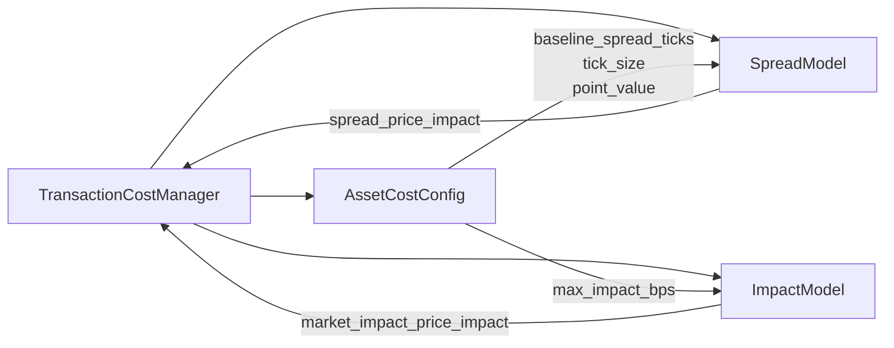

# Transaction Cost Module

## Overview

The transaction cost module (`src/transaction_cost/`) implements a comprehensive cost model for futures trading based on Robert Carver's methodology. It separates costs into **explicit** (commissions/fees) and **implicit** (spread + market impact) components.

> **Key Design Decision**: Execution prices remain pure reference prices (previous day close). All costs are calculated separately and deducted from the equity curve.

---

## Architecture

```
transaction_cost/
├── asset_cost_config.cpp        # Per-symbol cost parameters
├── impact_model.cpp             # Square-root market impact model
├── spread_model.cpp             # Tick-based spread with volatility widening
└── transaction_cost_manager.cpp # Orchestrator for cost calculations
```



---

## Components

### 1. TransactionCostManager

**File**: `src/transaction_cost/transaction_cost_manager.cpp`

The central orchestrator that combines spread and impact models to calculate total costs.

#### Key Methods

```cpp
// Calculate costs with internally tracked ADV and volatility
TransactionCostResult calculate_costs(
    const std::string& symbol,
    double quantity,
    double reference_price) const;

// Calculate costs with explicit ADV and volatility
TransactionCostResult calculate_costs(
    const std::string& symbol,
    double quantity,
    double reference_price,
    double adv,
    double volatility_multiplier) const;

// Update market data for rolling calculations
void update_market_data(
    const std::string& symbol,
    double volume,
    double close_price,
    double prev_close_price);

// Register per-symbol configuration
void register_asset_config(const AssetCostConfig& config);
```

#### TransactionCostResult Structure

```cpp
struct TransactionCostResult {
    double commissions_fees;            // Explicit: |qty| × fee_per_contract
    double spread_price_impact;         // Implicit: half-spread in price units
    double market_impact_price_impact;  // Implicit: impact in price units
    double implicit_price_impact;       // Sum of spread + impact
    double slippage_market_impact;      // Implicit in dollars
    double total_transaction_costs;     // Explicit + implicit in dollars
};
```

---

### 2. SpreadModel

**File**: `src/transaction_cost/spread_model.cpp`

Implements tick-based spread with volatility regime widening.

#### Formula

```
spread_ticks = clamp(baseline_spread_ticks × vol_mult, min_spread_ticks, max_spread_ticks)
spread_price_impact = 0.5 × spread_ticks × tick_size
```

Where:
- `baseline_spread_ticks`: Configured per-symbol (typically 1-2 for liquid futures)
- `vol_mult`: Volatility multiplier (0.8 to 1.5), widens during high volatility
- Half-spread is used because we only pay the spread on one side

#### Volatility Regime Widening

```cpp
// Rolling log returns for volatility estimation
void update_log_returns(const std::string& symbol, double log_return);

// Calculate volatility multiplier
double get_volatility_multiplier(const std::string& symbol) const;
```

The volatility multiplier is calculated as:
```
z_σ = clip((σ_current - σ_mean) / σ_stdev, -2, 2)
vol_mult = clip(1 + λ × z_σ, 0.8, 1.5)
```

Where λ is typically 0.10-0.25.

---

### 3. ImpactModel

**File**: `src/transaction_cost/impact_model.cpp`

Implements the square-root market impact law.

#### Formula

```
participation = |quantity| / ADV
impact_bps = k_bps × √participation
market_impact_price_impact = (impact_bps / 10000) × reference_price
```

#### ADV Buckets and k_bps Selection

```cpp
double get_impact_k_bps(double adv) {
    if (adv > 1000000) return 10;  // Ultra liquid
    if (adv > 200000)  return 20;  // Liquid
    if (adv > 50000)   return 40;  // Medium
    if (adv > 20000)   return 60;  // Thin
    return 80;                      // Very thin
}
```

#### Rolling ADV Calculation

```cpp
// Update daily volume (no lookahead - uses t-1 to t-N)
void update_volume(const std::string& symbol, double volume);

// Get 20-day rolling average
double get_adv(const std::string& symbol) const;
```

---

### 4. AssetCostConfig

**File**: `src/transaction_cost/asset_cost_config.cpp`

Stores per-symbol cost parameters.

#### Configuration Structure

```cpp
struct AssetCostConfig {
    std::string symbol;
    
    // Spread parameters
    double baseline_spread_ticks = 1.0;    // Typical spread in ticks
    double min_spread_ticks = 1.0;         // Floor
    double max_spread_ticks = 5.0;         // Cap
    double tick_size = 0.01;               // Price increment
    
    // Point value
    double point_value = 1.0;              // Dollar value per point
    
    // Impact caps
    double max_impact_bps = 50.0;          // Maximum impact in bps
};
```

#### Example Configurations

| Symbol | Tick Size | Point Value | Baseline Spread |
|--------|-----------|-------------|-----------------|
| ES | 0.25 | 50 | 1 tick |
| NQ | 0.25 | 20 | 1 tick |
| CL | 0.01 | 1000 | 2 ticks |
| GC | 0.10 | 100 | 1 tick |
| ZN | 1/64 | 1000 | 1 tick |

---

## Usage

### In Backtesting

```cpp
// Create configuration
transaction_cost::TransactionCostManager::Config config;
config.explicit_fee_per_contract = 1.75;  // $1.75 round-trip
config.spread_config = spread_config;
config.impact_config = impact_config;

// Create manager
auto cost_manager = std::make_unique<transaction_cost::TransactionCostManager>(config);

// Register asset configurations
for (const auto& symbol : symbols) {
    AssetCostConfig asset_config = get_config_for_symbol(symbol);
    cost_manager->register_asset_config(asset_config);
}

// Calculate costs for an execution
auto result = cost_manager->calculate_costs("ES", 10, 5000.0);
// result.total_transaction_costs ≈ $91.18
```

### In Portfolio Manager

The `PortfolioManager` uses the cost manager in two places:

1. **Optimization Costs** (`calculate_trading_costs`)
   ```cpp
   // Pass costs to DynamicOptimizer
   costs = calculate_trading_costs(symbols, capital);
   optimizer->optimize(current_pos, target_pos, costs, ...);
   ```

2. **Execution Recording**
   ```cpp
   // Store costs in ExecutionReport
   auto cost_result = cost_manager_.calculate_costs(symbol, trade_size, price);
   exec.commissions_fees = Decimal(cost_result.commissions_fees);
   exec.total_transaction_costs = Decimal(cost_result.total_transaction_costs);
   ```

---

## Worked Examples

### Example 1: ES (E-mini S&P 500) - Liquid

**Given**:
- Reference Price: $5,000
- Quantity: 10 contracts
- Tick Size: 0.25
- Point Value: 50
- Baseline Spread: 1 tick
- ADV: 500,000

**Calculation**:

```
1. Explicit Costs:
   commissions_fees = |10| × $1.75 = $17.50

2. Spread Impact:
   spread_ticks = 1 × 1.0 = 1 tick
   spread_price_impact = 0.5 × 1 × 0.25 = 0.125 points

3. Market Impact:
   participation = 10 / 500,000 = 0.00002
   impact_bps = 10 × √0.00002 = 0.0447 bps
   market_impact = (0.0447/10000) × 5000 = 0.02235 points

4. Total Implicit:
   implicit_price_impact = 0.125 + 0.02235 = 0.14735 points
   slippage_market_impact = 0.14735 × 10 × 50 = $73.68

5. Total Transaction Costs:
   $17.50 + $73.68 = $91.18
```

### Example 2: CL (Crude Oil) - Medium Liquid

**Given**:
- Reference Price: $75.00
- Quantity: 5 contracts
- Tick Size: 0.01
- Point Value: 1000
- Baseline Spread: 2 ticks
- ADV: 200,000

**Calculation**:

```
1. Explicit: |5| × $1.75 = $8.75
2. Spread: 0.5 × 2 × 0.01 = 0.01 points
3. Impact: 20 × √(5/200000) × 75/10000 = 0.00075 points
4. Implicit: (0.01 + 0.00075) × 5 × 1000 = $53.75
5. Total: $8.75 + $53.75 = $62.50
```

---

## Database Schema

The transaction cost columns are stored in the `executions` table:

```sql
-- Backtest executions
CREATE TABLE backtest.executions (
    id SERIAL PRIMARY KEY,
    timestamp TIMESTAMPTZ,
    symbol VARCHAR(10),
    quantity DOUBLE PRECISION,
    price DOUBLE PRECISION,           -- Pure reference price (prev day close)
    commissions_fees DOUBLE PRECISION,         -- Explicit costs
    implicit_price_impact DOUBLE PRECISION,    -- Spread + impact (price units)
    slippage_market_impact DOUBLE PRECISION,   -- Implicit costs (dollars)
    total_transaction_costs DOUBLE PRECISION   -- All costs (dollars)
);
```

---

## PnL Integration (Approach B)

Transaction costs are integrated into PnL using "Approach B" - separate deduction:

```
daily_equity = prev_equity + gross_position_pnl - daily_transaction_costs
```

Where:
- `gross_position_pnl` is calculated from reference prices (no costs embedded)
- `daily_transaction_costs = Σ(executions.total_transaction_costs)`

This approach:
- Keeps execution prices pure (for analysis)
- Stores costs transparently (for auditing)
- Allows cost breakdown by component

---

## Configuration Reference

### Full Config Structure

```cpp
// TransactionCostManager::Config
struct Config {
    double explicit_fee_per_contract = 1.75;  // All-in per contract per side
    SpreadModel::Config spread_config;
    ImpactModel::Config impact_config;
};

// SpreadModel::Config
struct SpreadConfig {
    double lambda = 0.15;           // Volatility sensitivity
    int vol_lookback = 20;          // Days for volatility calculation
};

// ImpactModel::Config
struct ImpactConfig {
    int adv_lookback = 20;          // Days for ADV calculation
    double min_adv = 1000.0;        // Minimum ADV floor
};
```

---

## Testing

```bash
# Run transaction cost tests
cd build
ctest -R transaction_cost --output-on-failure
```

Test cases cover:
- Basic cost calculation
- ADV bucket selection
- Volatility regime widening
- Zero-quantity edge case
- Cap/floor enforcement

---

## References

- [Backtest Module](../backtest/README.md) - Integration with backtesting
- [Portfolio Module](../portfolio/README.md) - Cost-aware optimization
- [Optimization Module](../optimization/README.md) - Cost penalty in optimization
- **Robert Carver** - *Systematic Trading* and *Advanced Futures Trading Strategies*
